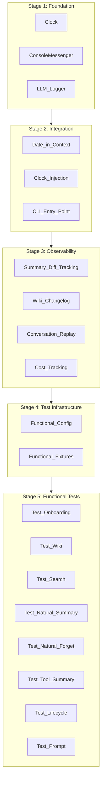

# Console Messenger and Memory System Functional Testing

## Overview

Phase 5 (Memory System) is fully implemented. We need to verify it works end-to-end -- summarization quality, tool call behavior in summaries, forgetting engine consolidation, wiki interactions, and prompt assembly. The memory system is time-dependent (daily/weekly/monthly cycles), so we need time offset simulation and a scriptable messenger interface.

The plan is organized into **5 sequential stages**. Each stage is a self-contained batch of work: all tasks within a stage have no unresolved dependencies on other tasks in the same or later stages. A programmer implements all tasks in Stage N before moving to Stage N+1.



---

## Stage 1: Foundation (no dependencies)

Three independent components that form the base layer. Can be implemented in any order within this stage.

### 1A. Clock with Time Offset System

**New file:** [`src/mai_companion/clock.py`](src/mai_companion/clock.py)

```python
class Clock:
    """Per-chat time offset clock."""
    
    def __init__(self, offset: timedelta | None = None):
        self._offset = offset or timedelta()
    
    def now(self) -> datetime:
        return datetime.now(timezone.utc) + self._offset
    
    def today(self) -> date:
        return self.now().date()
    
    @classmethod
    def for_target_date(cls, target: date) -> "Clock":
        """Create a clock whose 'today' is the given target date."""
        real_now = datetime.now(timezone.utc)
        target_start = datetime.combine(target, real_now.time(), tzinfo=timezone.utc)
        offset = target_start - real_now
        return cls(offset=offset)
    
    @property
    def offset(self) -> timedelta:
        return self._offset
```

**Offset persistence:** Stored in `data/.console_state.json` per chat-id (as `time_offset_seconds`). When you set a target date for a chat, the offset is saved. All subsequent messages to that chat use the same offset until changed.

**Monotonic timestamp enforcement:** Before saving any message, check that the new virtual timestamp is strictly after the last message in the conversation. If violated, fail with: `"Error: target date 2026-01-05 would place this message before the last message at 2026-01-10T15:30:00. Messages must be chronologically ordered."`

---

### 1B. Console Messenger Implementation

**New file:** [`src/mai_companion/messenger/console.py`](src/mai_companion/messenger/console.py)

Implements the [`Messenger`](src/mai_companion/messenger/base.py) interface. Non-interactive, single-shot. Permanent project feature.

**Key behaviors:**

- `send_message()` prints the AI's response to stdout in a structured format
- Buttons displayed as numbered options with callback data:
  ```
  --- AI Response ---
  Hello! I'll communicate with you in English.
  Now, what name would you like to give ME?
  
  --- Buttons ---
  [1] Choose a Preset  ->  personality:presets
  [2] Customize Traits  ->  personality:custom
  ```

- `send_typing_indicator()` is a no-op
- `edit_message()` prints the new text (with a note that it replaces a previous message)
- Handler registration works the same as Telegram -- the `BotHandler` registers its handlers, and the console messenger dispatches to them

---

### 1C. Structured LLM Interaction Logging

**New files:** [`src/mai_companion/debug/__init__.py`](src/mai_companion/debug/__init__.py), [`src/mai_companion/debug/llm_logger.py`](src/mai_companion/debug/llm_logger.py)

A decorator/proxy around [`LLMProvider`](src/mai_companion/llm/provider.py) that captures every LLM call. Wraps the `generate()` method.

**For each call, capture:**

- Sequence number and virtual timestamp
- Full message list (system prompt, conversation history, tool messages)
- Tools provided to the model (names + schemas)
- Model response (content + tool calls with arguments)
- Tool execution results
- Token usage (prompt/completion/total) -- uses existing [`TokenUsage`](src/mai_companion/llm/provider.py) from `LLMResponse.usage`
- Model name used

**Output:** JSON Lines files in `data/debug_logs/{chat_id}/YYYY-MM-DD.jsonl`. One entry per LLM call. Enabled via `--debug` flag or config.

**Console output in debug mode:** After the AI response, print a summary:

```
--- Debug Info ---
LLM calls: 2 (1 with tool calls)
Tools used: wiki_create("human_name", importance=9999), search_messages("Paris")
Tokens: 1,250 prompt + 180 completion = 1,430 total
Full log: data/debug_logs/test-1/2026-02-19.jsonl
```

---

## Stage 2: Integration (depends on Stage 1)

Wire the foundation components into the existing codebase and build the CLI entry point.

### 2A. Current Date/Time in AI Context

Currently, the AI has **no idea** what date or time it is. The [`PromptBuilder`](src/mai_companion/core/prompt_builder.py) assembles system prompt + wiki + summaries + messages, but never includes the current date. Messages in the LLM history are plain text without timestamps.

This is a genuine improvement to the production system, not just a testing concern. In real messenger conversations, humans always see timestamps. The AI should know "when" it is, so it can say things like "good morning" or "we talked about this yesterday."

**Changes to [`PromptBuilder.build_context()`](src/mai_companion/core/prompt_builder.py):**

1. Accept a `clock: Clock` parameter (or `current_time: datetime`)
2. Add a date/time section to the system prompt:
   ```
   ## Current date and time
   Right now it is: Thursday, February 19, 2026, 14:35 UTC.
   ```

3. Add timestamps to short-term message history. Instead of plain `content`, prefix each message with its timestamp:
   ```
   [2026-02-19 14:30] Human's message text here
   ```


This mirrors how the summarizer already formats messages for daily summaries (`[HH:MM] role: content`).

---

### 2B. Clock Injection into Memory Subsystems

Thread the `Clock` through all components that currently use `datetime.now()`:

| Component | Current behavior | Change |

|---|---|---|

| [`MessageStore.save_message()`](src/mai_companion/memory/messages.py) | `timestamp` defaults to DB `server_default=func.now()` | Pass `clock.now()` as `timestamp` |

| [`MessageStore.get_short_term()`](src/mai_companion/memory/messages.py) | `now` param defaults to `datetime.now(timezone.utc)` | Pass `clock.now()` |

| [`MemorySummarizer.trigger_daily_if_needed()`](src/mai_companion/memory/summarizer.py) | Uses `datetime.now(timezone.utc).date()` | Pass `clock.today()` |

| [`ForgettingEngine.run_forgetting_cycle()`](src/mai_companion/memory/forgetting.py) | `today` param defaults to `datetime.now(timezone.utc).date()` | Pass `clock.today()` |

| [`MemoryManager`](src/mai_companion/memory/manager.py) | Delegates to above | Accept `Clock`, forward to subsystems |

| [`BotHandler._handle_conversation()`](src/mai_companion/bot/handler.py) | Calls `memory_manager.save_message()` and `run_forgetting_cycle()` | Thread `Clock` through the flow |

The key insight: with clock injection, summarization and forgetting trigger **naturally** when conditions are met. No special commands needed. Example flow:

1. Send 5+ messages on "January 1" (with threshold=5 in test config)
2. Change date to "January 2", send more messages -> daily summary for Jan 1 triggers automatically
3. Change date to "January 15" -> forgetting cycle runs automatically and consolidates old dailies into weekly

**Manual override commands** (kept as secondary option for edge cases):

```bash
mai-chat --force-summary 2026-01-01
mai-chat --force-forgetting
```

---

### 2C. CLI Entry Point with State Persistence

**New file:** [`src/mai_companion/console_runner.py`](src/mai_companion/console_runner.py)

**Short command name:** Register as `mai-chat` in [`pyproject.toml`](pyproject.toml) under `[project.scripts]`:

```toml
[project.scripts]
mai-chat = "mai_companion.console_runner:main"
```

After `pip install -e .`, the user types just `mai-chat`.

**State persistence file:** `data/.console_state.json`

```json
{
  "last_chat_id": "test-chat-1",
  "chats": {
    "test-chat-1": {
      "time_offset_seconds": -3456000
    }
  }
}
```

**Usage -- minimal typing for common operations:**

```bash
# First time: specify chat-id (saved for future use)
mai-chat -c test-1 "Hello, how are you?"

# Subsequent messages: chat-id remembered
mai-chat "I love Thai food"

# Start onboarding (create new companion)
mai-chat -c new-companion --start

# Send a callback (button press)
mai-chat --cb "preset:balanced"

# Set target date for time offset (saved per chat)
mai-chat --date 2026-01-01 "Happy New Year!"

# Change date later
mai-chat --date 2026-01-08 "How was your week?"

# View conversation history
mai-chat --history

# View wiki entries
mai-chat --wiki

# View summaries
mai-chat --summaries

# Show the full prompt that would be sent to the model
mai-chat --show-prompt

# Seed messages from a file (JSONL: {"role": "user", "content": "...", "date": "2026-01-01"})
mai-chat --seed messages.jsonl

# Enable debug logging for this invocation
mai-chat --debug "Tell me about Paris"
```

**Parameter persistence rules:**

| Parameter | Persisted? | Notes |

|---|---|---|

| `chat-id` (`-c`) | Yes | Last used chat-id is the default |

| `time offset` (`--date`) | Yes, per chat | Stored per chat-id |

| `--debug` | No | Opt-in per invocation |

| `--start`, `--cb`, `--history`, etc. | No | Action flags, not state |

---

## Stage 3: Observability (depends on Stage 2)

Four independent observability features that enhance debugging and testing quality. Can be implemented in any order within this stage.

### 3A. Summary Diff Tracking

When the [`ForgettingEngine`](src/mai_companion/memory/forgetting.py) consolidates dailies into a weekly or weeklies into a monthly, log what was replaced.

**Where to hook:** In `ForgettingEngine._consolidate_old_dailies()` (before calling `delete_daily()`) and `_consolidate_old_weeklies()` (before calling `delete_weekly()`).

**Output:** Save a "before and after" comparison to `data/debug_logs/{companion_id}/consolidation/`:

```
data/debug_logs/{companion_id}/consolidation/
  weekly_2026-W01.md      # Contains: original dailies text + resulting weekly summary
  monthly_2026-01.md      # Contains: original weeklies text + resulting monthly summary
```

Each file format:

```markdown
# Weekly Consolidation: 2026-W01
## Date: 2026-01-20 (when consolidation ran)

## Original Daily Summaries (deleted)
### 2026-01-01
[full daily summary text]
### 2026-01-02
[full daily summary text]
...

## Resulting Weekly Summary
[full weekly summary text]
```

This helps evaluate whether the forgetting engine preserves important information.

---

### 3B. Wiki Changelog

Track wiki entry creation/edit/delete events with timestamps.

**Where to hook:** In [`WikiMCPServer.call_tool()`](src/mai_companion/mcp_servers/wiki_server.py) -- after each successful `_call_create`, `_call_edit`, `_call_delete`.

**Output:** Append-only log file at `data/{companion_id}/wiki/changelog.jsonl`:

```json
{"timestamp": "2026-01-01T14:30:00Z", "action": "create", "key": "human_name", "content": "Alex", "importance": 9999}
{"timestamp": "2026-01-01T14:30:05Z", "action": "create", "key": "human_birthday", "content": "March 15", "importance": 7000}
{"timestamp": "2026-01-05T10:15:00Z", "action": "edit", "key": "human_name", "content": "Alexander", "importance": 9999}
{"timestamp": "2026-02-01T09:00:00Z", "action": "delete", "key": "old_preference"}
```

This makes it easy to see what the AI decided to remember and when, and to trace memory evolution over time.

---

### 3C. Conversation Replay

Add a `--replay` command to `mai-chat` that re-reads the conversation history from the database and prints it formatted with timestamps, roles, and any tool calls.

**Usage:**

```bash
mai-chat --replay              # Full history for current chat
mai-chat --replay --date 2026-01-05  # Just that day
```

**Output format:**

```
=== Conversation Replay: test-1 ===
=== Date: 2026-01-01 ===

[14:30:00] USER: Hello, how are you?
[14:30:05] ASSISTANT: Hey! I'm doing well. What's your name?
[14:31:00] USER: I'm Alex
[14:31:08] ASSISTANT: Nice to meet you, Alex!
           [tool] wiki_create(key="human_name", content="Alex", importance=9999)

=== Date: 2026-01-02 ===
...
```

**Implementation:** Query `MessageStore` for the chat's messages, format with timestamps. Tool call information can be extracted from the debug logs if available, or from message content patterns.

---

### 3D. Cost Tracking

Track cumulative token usage and estimated cost per test session.

**Where to hook:** In the LLM Logger (from Stage 1C). Accumulate `TokenUsage` from each `LLMResponse`.

**Console output:** After each AI response (in debug mode), show running totals:

```
--- Session Cost ---
This call: 1,430 tokens ($0.002)
Session total: 12,350 tokens ($0.015)
```

**End-of-session summary** (for automated tests): The functional test fixtures print a final cost report:

```
--- Test Session Cost ---
Total LLM calls: 47
Total tokens: 125,430 (98,200 prompt + 27,230 completion)
Estimated cost: $0.18 (gpt-4o-mini pricing)
```

**Pricing data:** Store a simple dict of model -> price-per-token in the config. Default pricing for common models (gpt-4o-mini, gpt-4o, etc.). Prices are approximate -- this is for budgeting, not billing.

---

## Stage 4: Test Infrastructure (depends on Stage 3)

### 4A. Functional Test Configuration

**New file:** [`tests/functional/functional_config.toml`](tests/functional/functional_config.toml)

```toml
[llm]
model = "openai/gpt-4o-mini"        # Cheaper model for testing
# model = "openai/gpt-4o"           # Use for quality-sensitive tests

[memory]
summary_threshold = 5                # Lower threshold for faster triggering
short_term_limit = 30
wiki_context_limit = 20
tool_max_iterations = 5

[testing]
data_dir = "./data/functional_tests"  # Isolated from production data
debug_logging = true                  # Always log in functional tests
```

Keeps test settings separate from production `.env`.

---

### 4B. Functional Test Fixtures and Infrastructure

**New files:** `tests/functional/__init__.py`, [`tests/functional/conftest.py`](tests/functional/conftest.py)

Fixtures providing:

- Real `LLMProvider` (OpenRouter) configured from `functional_config.toml`
- Isolated database (separate SQLite file in test data dir)
- `ConsoleMessenger` instance
- `Clock` with configurable offsets
- LLM Logger with cost tracking
- Helper functions:
  - `send_message(chat_id, text, target_date=None)` -- sends a message and returns the AI response
  - `send_callback(chat_id, callback_data)` -- simulates button press
  - `get_wiki_entries(companion_id)` -- reads wiki
  - `get_summaries(companion_id)` -- reads all summaries
  - `get_debug_log(chat_id, date)` -- reads debug log entries
- `@pytest.mark.functional` marker -- tests skipped unless `--run-functional` is passed to pytest or `OPENROUTER_API_KEY` is set

**New directory:** `tests/functional/seed_data/` with JSONL files for seeding conversations:

- `basic_conversation.jsonl` -- simple multi-turn conversation
- `multi_topic_day.jsonl` -- conversation covering many topics (for summarization quality)
- `with_tool_calls.jsonl` -- conversation where AI made tool calls
- `paris_trip.jsonl` -- 15 messages about a Paris trip spanning 3 days

---

## Stage 5: Functional Test Scenarios (depends on Stage 4)

All tests use real LLM calls. Each test is independent of the others within this stage.

### 5A. Onboarding via Console (`test_onboarding.py`)

1. Start onboarding with `--start` -> verify welcome message + language prompt
2. Walk through the full onboarding flow using callbacks (`--cb`)
3. Verify companion created in DB with correct traits
4. Send first message, verify AI responds in character

### 5B. Wiki Creation and Retrieval (`test_wiki_memory.py`)

1. Create companion (via fixture)
2. Send: "My name is Alex and my birthday is March 15"
3. Inspect debug log: verify `wiki_create` tool calls
4. Inspect wiki directory: verify entries exist with appropriate importance
5. Check wiki changelog: verify creation events logged
6. Send: "What's my name?" -> verify AI knows without tool call (from context)

### 5C. Message Search (`test_message_search.py`)

1. Seed 15 messages about a Paris trip with timestamps spanning 3 days
2. Set date to 2 weeks later
3. Send: "Remember when we talked about visiting Paris?"
4. Verify in debug log: `search_messages` tool was called with "Paris" or similar
5. Verify AI response references specific details from seeded messages

### 5D. Natural Daily Summarization (`test_natural_summarization.py`)

Tests the natural triggering path (no manual force).

1. Set threshold to 5 in test config
2. Set date to Jan 1, send 4 messages (no summary yet)
3. Send 5th message -> daily summary triggers automatically
4. Read summary file for Jan 1 -> verify it exists and mentions key topics
5. Set date to Jan 2, send 5 more messages -> Jan 2 summary triggers
6. Verify both daily summary files exist

### 5E. Natural Forgetting Cycle (`test_natural_forgetting.py`)

1. Create daily summaries for Jan 1-7 (via seeded conversations + summarization)
2. Set date to Jan 20 (more than 7 days after week ends)
3. Send any message -> forgetting cycle runs automatically after AI response
4. Verify: weekly summary for W01 exists
5. Verify: daily files for Jan 1-5 (Mon-Fri of W01) are deleted
6. Check consolidation diff file: verify it contains original dailies + resulting weekly
7. Set date to March 1 (more than 28 days after January ends)
8. Send another message -> monthly consolidation triggers
9. Verify: monthly summary for January exists, old weeklies deleted

### 5F. Tool Calls in Summarization (`test_tool_call_summarization.py`)

The key concern: how do tool calls look in summaries?

1. Have a real conversation where AI makes wiki_create and search_messages calls
2. Trigger daily summary for that day
3. Read the summary and assert:

   - Summary is pure prose (no JSON artifacts, no raw tool call syntax)
   - Summary mentions what the AI learned/remembered (the intent, not the mechanism)
   - No hallucinated tool calls in the summary text

4. Log the full summary for human review

### 5G. Full Multi-Week Lifecycle (`test_full_lifecycle.py`)

The comprehensive integration test:

1. **Week 1:** Create companion on Jan 1. Have 5 real exchanges per day for 7 days (using date offsets). AI should naturally create wiki entries.
2. **Verify week 1:** Daily summaries exist for each day. Wiki has entries. Wiki changelog shows creation events.
3. **Week 2:** Continue conversations Jan 8-14. Reference week 1 topics.
4. **Week 3 (Jan 20):** Forgetting cycle consolidates week 1 dailies into weekly.
5. **Verify:** Weekly summary for W01 exists. Daily files for W01 gone. Consolidation diff file saved.
6. **Month 2 (Feb 15):** Send message referencing January content.
7. **Verify:** AI can still recall via weekly summaries or message search.
8. **Month 3 (Mar 5):** Monthly consolidation triggers for January.
9. **Verify:** Monthly summary exists. Old weeklies for January deleted. Consolidation diff saved.
10. **Final check:** Send "What do you remember about our first week?" -> AI uses monthly summary + message search to reconstruct.
11. **Cost report:** Print total tokens and estimated cost for the entire lifecycle test.

### 5H. Prompt Assembly Inspection (`test_prompt_inspection.py`)

Not an LLM test -- inspects what the model would receive:

1. Seed wiki entries, summaries, and messages
2. Call `PromptBuilder.build_context()` directly
3. Assert: system prompt contains "Things you know" with wiki entries
4. Assert: system prompt contains "Your memories" with summaries
5. Assert: system prompt contains "Current date and time"
6. Assert: messages include timestamps
7. Assert: total token count is within budget

---

## File Structure Summary

```
src/mai_companion/
  clock.py                          # [1A] Time offset clock
  console_runner.py                 # [2C] CLI entry point (mai-chat)
  messenger/
    console.py                      # [1B] ConsoleMessenger implementation
  debug/
    __init__.py                     # [1C] Debug package init
    llm_logger.py                   # [1C] Structured LLM interaction logging
    cost_tracker.py                 # [3D] Token usage and cost tracking

tests/
  functional/
    __init__.py                     # [4B] Functional test package
    conftest.py                     # [4B] Shared fixtures
    functional_config.toml          # [4A] Test-specific configuration
    test_onboarding.py              # [5A] Onboarding flow
    test_wiki_memory.py             # [5B] Wiki creation/retrieval
    test_message_search.py          # [5C] Message search tool
    test_natural_summarization.py   # [5D] Natural daily summary triggering
    test_natural_forgetting.py      # [5E] Natural forgetting cycle
    test_tool_call_summarization.py # [5F] Tool calls in summaries
    test_full_lifecycle.py          # [5G] Multi-week lifecycle
    test_prompt_inspection.py       # [5H] Prompt assembly verification
    seed_data/                      # [4B] Seed conversation files
      basic_conversation.jsonl
      multi_topic_day.jsonl
      with_tool_calls.jsonl
      paris_trip.jsonl
```

---

## Modified Existing Files

| File | Stage | Changes |

|---|---|---|

| [`src/mai_companion/core/prompt_builder.py`](src/mai_companion/core/prompt_builder.py) | 2A | Add current date/time to system prompt; add timestamps to message history; accept `Clock` |

| [`src/mai_companion/bot/handler.py`](src/mai_companion/bot/handler.py) | 2B | Thread `Clock` through conversation flow |

| [`src/mai_companion/memory/manager.py`](src/mai_companion/memory/manager.py) | 2B | Accept `Clock`, pass to subsystems |

| [`src/mai_companion/memory/summarizer.py`](src/mai_companion/memory/summarizer.py) | 2B | Accept `Clock` for `trigger_daily_if_needed()` |

| [`src/mai_companion/memory/forgetting.py`](src/mai_companion/memory/forgetting.py) | 3A | Add summary diff tracking before deletion |

| [`src/mai_companion/mcp_servers/wiki_server.py`](src/mai_companion/mcp_servers/wiki_server.py) | 3B | Add wiki changelog logging after each tool call |

| [`pyproject.toml`](pyproject.toml) | 2C | Add `[project.scripts]` entry for `mai-chat` |