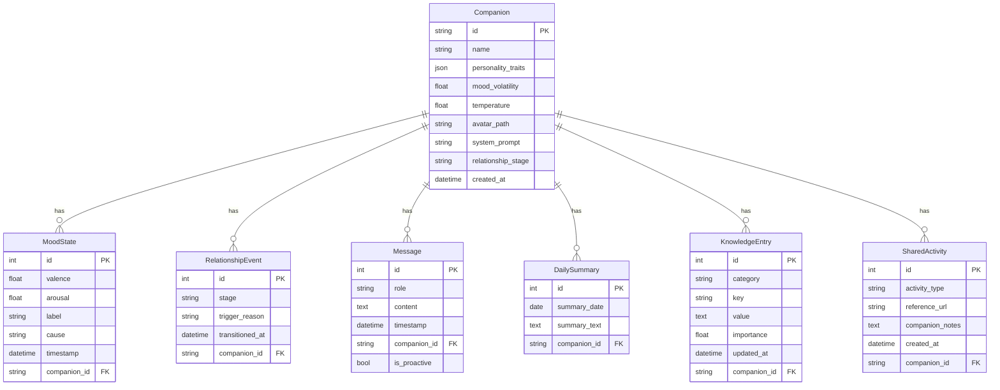

# mAI Companion -- Implementation Plan

## Vision Summary

A self-hosted AI companion that lives on the user's server (VPS, home server, or phone), communicates through Telegram like a real friend -- with persistent memory, unique personality, self-initiated messages, and respectful but independent behavior.

---

## Technology Stack

| Layer | Technology | Rationale |

|---|---|---|

| Language | **Python 3.12+** | Richest AI/ML ecosystem, async support, best Telegram libraries |

| Telegram | **python-telegram-bot v21+** | Mature, fully async, well-documented, 28k+ GitHub stars |

| LLM Gateway | **OpenRouter API** | Unified access to GPT-4o, Claude, Llama, Mistral, etc. User picks model |

| Database | **SQLite + SQLAlchemy (async)** | Zero-dependency, portable, perfect for single-user self-hosted |

| Vector Store | **ChromaDB** (embedded) | Local vector DB for semantic memory search, no external service |

| Task Scheduling | **APScheduler** | Cron-like scheduling for proactive behaviors and memory maintenance |

| Avatar Generation | **OpenRouter vision models / DALL-E API** | Generate companion portrait from character description |

| Testing | **pytest + pytest-asyncio** | Standard Python async testing |

| Packaging | **Docker + docker-compose** | Easy self-hosting on any VPS or home server |

| Config | **Pydantic Settings** | Type-safe configuration with `.env` file support |

---

## Architecture Overview


---

## Data Model



---

## Project Structure

```
mai-companion/
  src/
    mai_companion/
      __init__.py
      main.py                    # Entry point, wires everything together
      config.py                  # Pydantic settings, .env loading
      bot/
        __init__.py
        handler.py               # Telegram message/command handlers
        middleware.py             # Rate limiting, logging
        onboarding.py            # Character creation flow (RPG-style)
      core/
        __init__.py
        engine.py                # Main conversation engine
        prompt_builder.py        # Assembles system prompt + context
        response.py              # Response generation, streaming
      personality/
        __init__.py
        traits.py                # Trait definitions and validation
        character.py             # Character creation and management
        temperature.py           # Trait-to-temperature mapping
        mood.py                  # Dynamic mood system (valence/arousal model)
      relationship/
        __init__.py
        arc.py                   # Relationship stage progression logic
        stages.py                # Stage definitions and transition rules
        metrics.py               # Interaction depth/frequency tracking
      memory/
        __init__.py
        manager.py               # Orchestrates all memory subsystems
        messages.py              # Raw message storage (SQLite)
        summaries.py             # Daily/weekly summarization
        vector_store.py          # ChromaDB semantic search
        knowledge_base.py        # Wiki-like fact storage
        forgetting.py            # Graceful memory degradation over time
      activities/
        __init__.py
        shared.py                # Shared activity engine (watch/read/learn/play)
        content_parser.py        # URL/content extraction and summarization
      scheduler/
        __init__.py
        proactive.py             # Self-initiated message logic
        maintenance.py           # Memory compaction, summarization jobs
        heartbeat.py             # Periodic "thinking" and reflection
        mood_cycle.py            # Spontaneous mood shifts on schedule
      llm/
        __init__.py
        openrouter.py            # OpenRouter API client
        provider.py              # Abstract LLM provider interface
      avatar/
        __init__.py
        generator.py             # Avatar image generation
      db/
        __init__.py
        models.py                # SQLAlchemy ORM models
        database.py              # DB engine, session management
        migrations.py            # Schema versioning (simple)
  tests/
    conftest.py
    test_personality/
    test_relationship/
    test_memory/
    test_activities/
    test_core/
    test_bot/
    test_scheduler/
  docker-compose.yml
  Dockerfile
  pyproject.toml
  .env.example
```

---

## Implementation Phases

### Phase 1: Foundation -- Project Skeleton and Database

Set up the Python project with `pyproject.toml`, configure linting (ruff), create the SQLAlchemy models, database initialization, Pydantic config, and `.env.example`. This phase produces a runnable (but empty) project with working DB migrations and tests for the data layer.

Key files: `pyproject.toml`, `config.py`, `db/models.py`, `db/database.py`

### Phase 2: LLM Integration -- OpenRouter Client

Build the abstract LLM provider interface and the OpenRouter implementation. Support streaming responses, configurable model selection, temperature control, and token counting. Write unit tests with mocked API responses.

Key files: `llm/provider.py`, `llm/openrouter.py`

### Phase 3: Personality System -- Character Creation and Dynamic Mood

Implement the trait system with soft guardrails (RPG-style). Traits include: warmth, assertiveness, humor, curiosity, patience, directness, emotional_depth, independence, **mood_volatility**. Each trait maps to behavioral instructions in the system prompt and influences temperature. Instead of hard-blocking extreme configurations, the companion itself warns the user during creation ("With these traits I might be pretty difficult to get along with. Are you sure?"). Hard constraints are limited to ethical minimums (no self-harm encouragement, no manipulation, no gaslighting).

**Mood system.** Implement a two-axis emotional state model:

- **Valence** (positive ↔ negative) and **Arousal** (energetic ↔ calm) produce mood labels like "excited," "melancholic," "irritated," "serene."
- Mood shifts reactively based on conversation content (bad news → concern, fun exchange → brightened).
- Mood shifts spontaneously based on the mood_volatility parameter -- high volatility means frequent, dramatic random shifts; low volatility means steady and even-keeled.
- Mood persists across messages within a day and decays toward a baseline over time.
- Mood is injected into the companion's context so it can reason about and express its current emotional state.
- Mood affects response style: shorter/snappier when irritated, more playful when excited, more reflective when melancholic.

Key files: `personality/traits.py`, `personality/character.py`, `personality/temperature.py`, `personality/mood.py`

### Phase 4: Telegram Bot -- Basic Communication

Wire up `python-telegram-bot` with async handlers. Implement the `/start` command that triggers the onboarding (character creation) flow using Telegram's inline keyboards and conversation handlers. Messages are persisted to SQLite. The companion can hold a basic conversation using the personality system prompt.

Key files: `bot/handler.py`, `bot/onboarding.py`, `main.py`

### Phase 5: Memory System -- The Brain

This is the most critical phase. Implement a multi-tier memory architecture:

1. **Short-term memory**: Recent N messages (sliding window) included directly in context.
2. **Daily summaries**: At the end of each day (or when a threshold is reached), the LLM compresses the day's conversation into a concise summary. Stored in SQLite.
3. **Semantic search (vector memory)**: All messages are embedded and stored in ChromaDB. When the user references something from the past, relevant messages are retrieved via similarity search and injected into context.
4. **Knowledge base (wiki)**: Structured facts about the user and companion extracted automatically from conversations -- name, preferences, important dates, opinions, life events. Stored as key-value entries in SQLite with **importance scores**, always included in context.
5. **Graceful forgetting**: Very old memories degrade naturally over time. Low-importance facts fade ("You mentioned preferring Thai food at some point" instead of "On March 15th you said..."). High-importance facts (user's name, family members, major life events) persist forever. The user can explicitly pin memories with "remember this" to mark them as permanently important.

The prompt builder assembles context in this priority order:

- System prompt (personality + current mood + relationship stage)
- Knowledge base facts (always present, filtered by importance)
- Relevant vector search results (if topic seems to reference past)
- Recent daily summaries (last 7 days)
- Short-term message window (last ~30 messages)

Key files: `memory/manager.py`, `memory/messages.py`, `memory/summaries.py`, `memory/vector_store.py`, `memory/knowledge_base.py`, `memory/forgetting.py`, `core/prompt_builder.py`

### Phase 6: Relationship Arc System

Implement the relationship progression system that makes the companion evolve over time:

- **Stage definitions**: "Getting to know each other" (weeks 1-2), "Building trust" (weeks 2-8), "Established friendship" (months 2+), "Deep bond" (months 6+).
- **Interaction metrics**: Track message frequency, conversation depth, emotional exchanges, disagreements resolved, shared activities completed.
- **Natural transitions**: Stage progression is based on interaction quality and quantity, not rigid timers. A user who messages daily reaches deeper stages faster.
- **Behavioral modifiers per stage**: Early stages → more questions, more formal, less opinionated. Later stages → full personality expression, comfortable disagreements, inside jokes, hard truths.
- The current relationship stage is included in the companion's context and influences system prompt construction.

Key files: `relationship/arc.py`, `relationship/stages.py`, `relationship/metrics.py`

### Phase 7: Conversation Engine -- Bringing It Together

Build the main conversation engine that ties personality, mood, relationship arc, memory, and LLM together. The engine:

- Receives a user message
- Updates mood state based on conversation content
- Checks current relationship stage
- Queries memory for relevant context
- Builds the full prompt (personality + mood + relationship stage + memory)
- Calls OpenRouter
- Stores the response
- Triggers knowledge extraction (async background task)
- Implements **thinking out loud** patterns: partial responses, self-correction, genuine uncertainty. Sometimes the companion sends a quick first reaction ("Oh interesting...") followed by a more considered response after a short delay. Sometimes it admits "I honestly don't know. What do you think?"

The companion should feel natural: it can disagree, express opinions, refuse unreasonable requests, reference past conversations, show its unique personality, and reflect its current mood.

Key files: `core/engine.py`, `core/prompt_builder.py`, `core/response.py`

### Phase 8: Avatar Generation

When the character is created, generate a portrait image based on the personality traits and any description the user provides. Use OpenRouter's image-capable models or a dedicated image API (DALL-E, Stable Diffusion). The avatar is sent to the user and set as the bot's profile picture via Telegram API.

Key files: `avatar/generator.py`

### Phase 9: Shared Activities

Implement the system that lets the companion do things with the user, not just talk:

- **Content parsing**: Extract and summarize content from URLs (YouTube transcripts, articles, web pages).
- **Watch together**: User shares a YouTube link, companion "watches" it via transcript, they discuss.
- **Read together**: User shares an article, companion reads and summarizes it, they discuss over time.
- **Learn together**: User picks a topic, companion researches it, they explore it in conversation over days.
- **Games and play**: Simple text-based games, riddles, trivia, creative writing exercises.
- Shared activities are logged and become part of the relationship history, giving the companion things to reference and bond over.

Key files: `activities/shared.py`, `activities/content_parser.py`

### Phase 10: Proactive Behavior -- Self-Initiated Messages

Implement the scheduler system using APScheduler:

1. **Memory maintenance**: Daily summarization job, knowledge extraction, vector index updates, memory degradation (forgetting).
2. **Heartbeat/reflection**: Periodic "thinking" where the companion reviews recent conversations and may decide to message the user (e.g., "I was thinking about what you said earlier...").
3. **Deferred responses**: The companion can say "let me think about it" and schedule a follow-up message.
4. **Spontaneous mood shifts**: Periodic mood updates driven by the mood_volatility parameter. The companion may wake up in a different mood for no particular reason, just like a real person.
5. **Respect boundaries**: Time-of-day awareness (no messages at 3 AM), frequency limits, user-configurable quiet hours.
6. **Mirror user frequency**: Start very conservatively. If the user messages once a day, the companion initiates at most once every few days. Never message just to fill silence.
7. **Automated backups**: Daily encrypted backups of all data to a configurable location.

Key files: `scheduler/proactive.py`, `scheduler/maintenance.py`, `scheduler/heartbeat.py`, `scheduler/mood_cycle.py`

### Phase 11: Testing and Hardening

- Unit tests for every module (memory, personality, mood, relationship, LLM client, prompt builder, activities)
- Integration tests for the full conversation flow (mocked LLM)
- Functional tests for the Telegram bot (using `python-telegram-bot`'s test utilities)
- Edge cases: very long conversations, context window overflow, network failures, DB corruption recovery
- Mood system tests: verify mood shifts, persistence, decay, and behavioral influence
- Relationship arc tests: verify stage transitions, metric tracking, behavioral changes per stage

### Phase 12: Packaging and Deployment

- `Dockerfile` with multi-stage build
- `docker-compose.yml` with volume mounts for persistent data
- `.env.example` with all configuration options documented
- Simple setup script that guides the user through: creating a Telegram bot via BotFather, getting an OpenRouter API key, and launching the service

---

## Key Design Principles

1. **Single-user, self-hosted**: All data stays on the user's machine. No cloud dependency except the LLM API.
2. **One continuous conversation**: No chat topics or sessions. One infinite thread, like messaging a friend.
3. **Memory is first-class**: The companion genuinely remembers -- and naturally forgets. The multi-tier memory system (short-term, summaries, vector search, knowledge base with importance weighting, graceful forgetting) mirrors how human memory actually works.
4. **Living personality**: The companion is not static. It has a fixed character foundation but a dynamic mood that shifts reactively and spontaneously. A bad day is a bad day. A good mood is infectious. The mood_volatility parameter lets users create companions anywhere on the spectrum from emotionally steady to wildly unpredictable.
5. **Relationships evolve**: The companion does not behave the same on day 1 as on day 300. Natural relationship stages (getting to know each other → building trust → established friendship → deep bond) ensure the dynamic grows deeper over time.
6. **Independent personality**: The companion is not a servant. It has opinions, can disagree, can refuse, can be upset. Soft guardrails warn about extreme character configurations rather than hard-blocking them.
7. **Proactive, not just reactive**: The companion can initiate conversations, follow up on earlier topics, and work on tasks independently. Proactive messaging starts conservatively and grows with the relationship.
8. **Thinking out loud**: The companion does not always give polished answers. It can send partial reactions, correct itself, admit uncertainty -- just like a real person thinking through a problem.
9. **Shared experiences**: The companion can watch, read, learn, and play together with the user. These shared activities become part of the relationship's history.
10. **Extensible**: Clean module boundaries so future agent capabilities (web browsing, code execution, file management) can be added as plugins.
11. **Testable at every layer**: Each phase produces independently testable components.