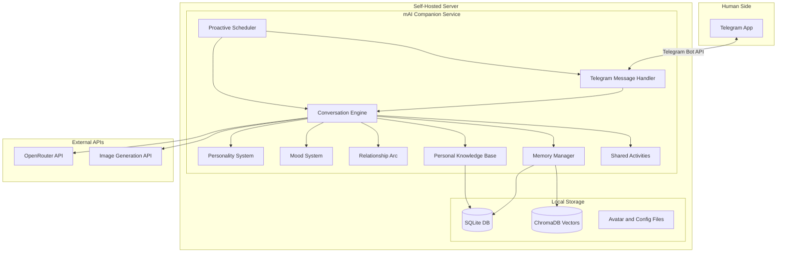
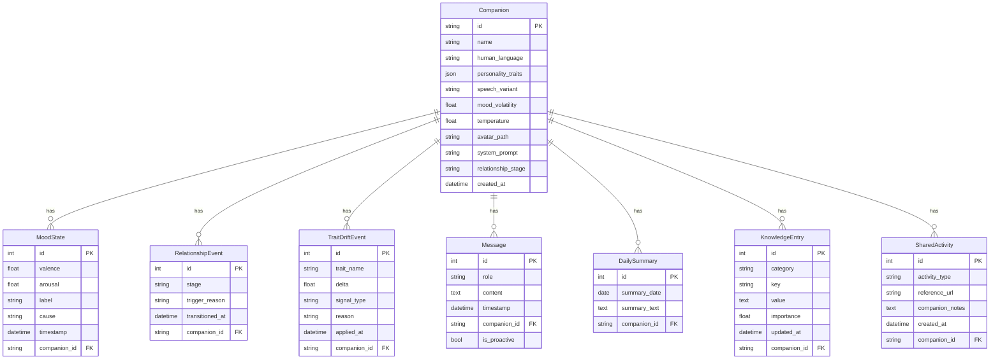

# mAI Companion -- Implementation Plan

## Vision Summary

A self-hosted AI companion that lives on the human's server (VPS, home server, or phone), communicates through Telegram like a real friend -- with persistent memory, unique personality, self-initiated messages, and respectful but independent behavior. Two companions communicate in chat -- an AI and a human.

---

## Technology Stack

| Layer | Technology | Rationale |

|---|---|---|

| Language | **Python 3.12+** | Richest AI/ML ecosystem, async support, best Telegram libraries |

| Telegram | **python-telegram-bot v21+** | Mature, fully async, well-documented, 28k+ GitHub stars |

| LLM Gateway | **OpenRouter API** | Unified access to GPT-4o, Claude, Llama, Mistral, etc. Human picks model |

| Database | **SQLite + SQLAlchemy (async)** | Zero-dependency, portable, perfect for single-human self-hosted |

| Vector Store | **ChromaDB** (embedded) | Local vector DB for semantic memory search, no external service |

| Task Scheduling | **APScheduler** | Cron-like scheduling for proactive behaviors and memory maintenance |

| Avatar Generation | **OpenRouter vision models / DALL-E API** | Generate companion portrait from character description |

| Testing | **pytest + pytest-asyncio** | Standard Python async testing |

| Packaging | **Docker + docker-compose** | Easy self-hosting on any VPS or home server |

| Config | **Pydantic Settings** | Type-safe configuration with `.env` file support |

---

## Architecture Overview



---

## Data Model



---

## Project Structure

```
mai-companion/
  src/
    mai_companion/
      __init__.py
      main.py                    # Entry point, wires everything together
      config.py                  # Pydantic settings, .env loading
      bot/
        __init__.py
        handler.py               # Telegram message/command handlers
        middleware.py             # Rate limiting, logging
        onboarding.py            # Character creation flow (RPG-style)
      core/
        __init__.py
        engine.py                # Main conversation engine
        prompt_builder.py        # Assembles system prompt + context
        response.py              # Response generation, streaming
      personality/
        __init__.py
        traits.py                # Trait definitions (6 in Wave 1, extensible), presets, validation
        character.py             # Character creation and management
        temperature.py           # Trait-to-temperature mapping
        mood.py                  # Dynamic mood system (valence/arousal model)
        trait_drift.py           # Gradual trait adjustment from human feedback (Phase 7+)
      relationship/
        __init__.py
        arc.py                   # Relationship stage progression logic
        stages.py                # Stage definitions and transition rules
        metrics.py               # Interaction depth/frequency tracking
      memory/
        __init__.py
        manager.py               # Orchestrates all memory subsystems
        messages.py              # Raw message storage (SQLite)
        summaries.py             # Daily/weekly summarization
        vector_store.py          # ChromaDB semantic search
        knowledge_base.py        # Wiki-like fact storage
        forgetting.py            # Graceful memory degradation over time
      activities/
        __init__.py
        shared.py                # Shared activity engine (watch/read/learn/play)
        content_parser.py        # URL/content extraction and summarization
      scheduler/
        __init__.py
        proactive.py             # Self-initiated message logic
        maintenance.py           # Memory compaction, summarization jobs
        heartbeat.py             # Periodic "thinking" and reflection
        mood_cycle.py            # Spontaneous mood shifts on schedule
      llm/
        __init__.py
        openrouter.py            # OpenRouter API client
        provider.py              # Abstract LLM provider interface
        translation.py           # LLM-powered translation service for multilingual onboarding
      avatar/
        __init__.py
        generator.py             # Avatar image generation
      db/
        __init__.py
        models.py                # SQLAlchemy ORM models
        database.py              # DB engine, session management
        migrations.py            # Schema versioning (simple)
  tests/
    conftest.py
    test_personality/
    test_relationship/
    test_memory/
    test_activities/
    test_core/
    test_bot/
    test_scheduler/
  docker-compose.yml
  Dockerfile
  pyproject.toml
  .env.example
```

---

## Implementation Phases

### Phase 1: Foundation -- Project Skeleton and Database

Set up the Python project with `pyproject.toml`, configure linting (ruff), create the SQLAlchemy models, database initialization, Pydantic config, and `.env.example`. This phase produces a runnable (but empty) project with working DB migrations and tests for the data layer.

Key files: `pyproject.toml`, `config.py`, `db/models.py`, `db/database.py`

### Phase 2: LLM Integration -- OpenRouter Client

Build the abstract LLM provider interface and the OpenRouter implementation. Support streaming responses, configurable model selection, temperature control, and token counting. Write unit tests with mocked API responses.

Key files: `llm/provider.py`, `llm/openrouter.py`

### Phase 3: Personality System -- Character Creation, Dynamic Mood, and Multilingual Support

Implement the trait system with soft guardrails (RPG-style) using a **data-driven, extensible architecture**. The full design includes 13 traits, but they are built in **waves**:

**Wave 1 (Phase 3 -- first prototype):** 6 traits that create meaningfully different personalities with zero runtime behavioral logic:

- **warmth** -- cold ↔ nurturing
- **humor** -- serious ↔ playful
- **patience** -- impatient ↔ thorough
- **directness** -- diplomatic ↔ blunt
- **laziness** -- tireless ↔ effort-avoiding (prompt-only in Wave 1, mood interaction later)
- **mood_volatility** -- emotionally steady ↔ unpredictable

**Wave 2 (Phase 7):** 5 more traits added when the conversation engine provides the context they need:

- assertiveness, curiosity, emotional_depth, independence (prompt-only)
- helpfulness (requires runtime logic to evaluate and refuse requests)

**Wave 3 (Phase 10+):** 2 traits requiring the scheduler and special systems:

- proactiveness (needs proactive scheduler)
- special_speech (needs speech variant registry, permanent selection, DB field)

**Also deferred:** Trait drift system (Phase 7+) -- needs conversation engine to detect feedback.

The architecture is dictionary-based: adding a trait means adding entries to `TRAIT_DEFINITIONS`, `TRAIT_BEHAVIORAL_INSTRUCTIONS`, and `TEMPERATURE_ADJUSTMENTS` dicts. The system prompt generator, temperature formula, and validation all loop over whatever traits exist -- zero rewrites needed.

Instead of hard-blocking extreme configurations, the AI companion itself warns the human during creation ("With these traits I might be pretty difficult to get along with. Are you sure?"). Hard constraints are limited to ethical minimums (no self-harm encouragement, no manipulation, no gaslighting).

**Multilingual onboarding.** Language selection is the first step of character creation. The human types their preferred language in free text, and all subsequent onboarding text is translated via LLM. The AI companion responds in the human's language by default but can switch naturally.

**Mood system.** Implement a two-axis emotional state model:

- **Valence** (positive ↔ negative) and **Arousal** (energetic ↔ calm) produce mood labels like "excited," "melancholic," "irritated," "serene."
- Mood shifts reactively based on conversation content (bad news → concern, fun exchange → brightened).
- Mood shifts spontaneously based on the mood_volatility parameter -- high volatility means frequent, dramatic random shifts; low volatility means steady and even-keeled.
- Mood persists across messages within a day and decays toward a baseline over time.
- Mood is injected into the AI companion's context so it can reason about and express its current emotional state.

Key files: `personality/traits.py`, `personality/character.py`, `personality/temperature.py`, `personality/mood.py`, `llm/translation.py`

### Phase 4: Telegram Integration -- Basic Communication

Wire up `python-telegram-bot` with async handlers. Implement the `/start` command that triggers the onboarding (character creation) flow using Telegram's inline keyboards and conversation handlers. Language selection is the first step, followed by name, personality (presets or custom trait configuration -- whatever traits are registered at that time), communication style, and optional appearance description. Messages are persisted to SQLite. The AI companion can hold a basic conversation using the personality system prompt.

Key files: `bot/handler.py`, `bot/onboarding.py`, `main.py`

### Phase 5: Memory System -- The Brain

This is the most critical phase. Implement a multi-tier memory architecture:

1. **Short-term memory**: Recent 30 messages (sliding window) included directly in context. And always all today messages. But all messages are stored forever and could be accesed using build-in MCP (see below).
2. **Summaries**: At the end of each day (or when a threshold is reached), the parallel AI memory subsystem (not the same as the AI companion) compresses the day's conversation into a concise summary. Stored as *.md files. After end of each week - weekly summaries. Then mounthly summaries. All summaries are automaticaly included in context (yes, this could be costly, but we need this quality of memory to achieve greate experience).
3. **Messeges search**: When the human references something from the past, the AI could use messeges tool to search exacly what happend in its messeges history using keywords search (like humans do using their messengers history). Let's implement this as build-in MCP (with possibility adding other MCPs in the future). Let's use only models with native tools support.
4. **Knowledge base (wiki)**: Structured facts about the human and the AI extracted from conversations by the AI companion itself -- name, preferences, important dates, opinions, life events, etc. Stored as key-value entries in wiki folder with **importance scores (e.g. 9999_human_name.md)**, 20 most important things are always included in context. AI can create/edit/read/search entries using another build-in MCP - wiki tools. Of cource, the human can ask the AI to add some important information to its wiki.
5. **Graceful forgetting**: The parallel AI memory subsystem summaries old entries into less verbose ones. For example after 4 weeks will be created mounthly summary with more condensed information about what happend during these weeks and the weeks memoried will be deleted. Thus low-importance facts fade ("You mentioned preferring Thai food at some point" instead of "On March 15th you said..."). High-importance facts (human's name, family members, major life events) persist forever in wiki and even very condesed memory (because the subsystem understands its importance).

The prompt builder assembles context in this priority order:

- System prompt (personality + current mood + relationship stage)
- Wiki base facts (always present, filtered by importance)
- All Summaries
- Short-term message window

Key files: `memory/manager.py`, `memory/messages.py`, `memory/summaries.py`, `memory/vector_store.py`, `memory/knowledge_base.py`, `memory/forgetting.py`, `core/prompt_builder.py`

### Phase 6: Relationship Arc System

Implement the relationship progression system that makes the companion evolve over time:

- **Stage definitions**: "Getting to know each other" (weeks 1-2), "Building trust" (weeks 2-8), "Established friendship" (months 2+), "Deep bond" (months 6+).
- **Interaction metrics**: Track message frequency, conversation depth, emotional exchanges, disagreements resolved, shared activities completed.
- **Natural transitions**: Stage progression is based on interaction quality and quantity, not rigid timers. A human who messages daily reaches deeper stages faster.
- **Behavioral modifiers per stage**: Early stages → more questions, more formal, less opinionated. Later stages → full personality expression, comfortable disagreements, inside jokes, hard truths.
- The current relationship stage is included in the AI companion's context and influences system prompt construction.

Key files: `relationship/arc.py`, `relationship/stages.py`, `relationship/metrics.py`

### Phase 7: Conversation Engine -- Bringing It Together

Build the main conversation engine that ties personality, mood, relationship arc, memory, and LLM together. **Also adds Wave 2 traits and trait drift system.**

**Wave 2 trait additions:**

- Add 5 new traits to the registry: assertiveness, curiosity, emotional_depth, independence, helpfulness
- Write 25 new behavioral instruction templates (5 traits × 5 levels)
- Implement helpfulness runtime logic (request evaluation, refusal based on mood/relationship/tone)
- Add mood × laziness and mood × helpfulness interaction modifiers
- Extend personality presets with Wave 2 trait values

**Trait drift system** (`personality/trait_drift.py`):

- TraitDriftManager with feedback recording, drift computation, and application
- TraitDriftEvent DB model and migration
- Max +/-0.02 per day, cumulative cap of +/-0.15

**Conversation engine:**

- Receives a message from the human
- Updates mood state based on conversation content
- Evaluates helpfulness and laziness modifiers based on current mood and request tone
- Checks current relationship stage
- Queries memory for relevant context
- Builds the full prompt (personality + behavioral dynamics + mood + relationship stage + memory)
- Calls OpenRouter
- Stores the response
- Triggers knowledge extraction (async background task)
- Records trait drift signals from the interaction (async background task)
- Implements **thinking out loud** patterns: partial responses, self-correction, genuine uncertainty. Sometimes the AI sends a quick first reaction ("Oh interesting...") followed by a more considered response after a short delay. Sometimes it admits "I honestly don't know. What do you think?"

The AI companion should feel natural: it can disagree, express opinions, refuse requests based on its helpfulness/mood/relationship, reference past conversations, and reflect its current mood.

Key files: `core/engine.py`, `core/prompt_builder.py`, `core/response.py`, `personality/trait_drift.py`

### Phase 8: Avatar Generation

When the character is created, generate a portrait image based on the personality traits and any description the human provides. Use OpenRouter's image-capable models or a dedicated image API (DALL-E, Stable Diffusion). The avatar is sent to the human and set as the AI companion's profile picture via Telegram API.

Key files: `avatar/generator.py`

### Phase 9: Shared Activities

Implement the system that lets the AI do things with the human, not just talk:

- **Content parsing**: Extract and summarize content from URLs (YouTube transcripts, articles, web pages).
- **Watch together**: Human shares a YouTube link, AI "watches" it via transcript, they discuss.
- **Read together**: Human shares an article, AI reads and summarizes it, they discuss over time.
- **Learn together**: Human picks a topic, AI researches it, they explore it in conversation over days. The AI's proactiveness trait influences how much initiative it takes in this.
- **Games and play**: Simple text-based games, riddles, trivia, creative writing exercises.
- Shared activities are logged and become part of the relationship history, giving both companions things to reference and bond over.

Key files: `activities/shared.py`, `activities/content_parser.py`

### Phase 10: Proactive Behavior -- Self-Initiated Messages

Implement the scheduler system using APScheduler. **Also adds Wave 3 traits.**

**Wave 3 trait additions:**

- Add proactiveness and special_speech traits to the registry
- Write 10 new behavioral instruction templates (2 traits × 5 levels)
- Implement speech variant system: SpeechVariant dataclass, SPEECH_VARIANTS registry, random selection, `speech_variant` DB field + migration
- Wire proactiveness trait into scheduler frequency and task selection

**Scheduler:**

1. **Memory maintenance**: Daily summarization job, knowledge extraction, vector index updates, memory degradation (forgetting).
2. **Heartbeat/reflection**: Periodic "thinking" where the AI reviews recent conversations and may decide to message the human (e.g., "I was thinking about what you said earlier..."). Frequency influenced by the proactiveness trait.
3. **Deferred responses**: The AI can say "let me think about it" and schedule a follow-up message.
4. **Spontaneous mood shifts**: Periodic mood updates driven by the mood_volatility parameter. The AI may wake up in a different mood for no particular reason, just like a real person.
5. **Proactive task execution**: Based on the proactiveness trait, the AI may prepare things in its "free time" -- research topics, summarize content, plan ahead. Complexity is capped by the laziness trait. Bias toward self-interest vs. human benefit depends on independence and helpfulness.
6. **Respect boundaries**: Time-of-day awareness (no messages at 3 AM), frequency limits, human-configurable quiet hours.
7. **Mirror human frequency**: Start very conservatively. If the human messages once a day, the AI initiates at most once every few days. Never message just to fill silence.
8. **Daily trait drift computation**: Apply accumulated feedback signals to gradually adjust traits.
9. **Automated backups**: Daily encrypted backups of all data to a configurable location.

Key files: `scheduler/proactive.py`, `scheduler/maintenance.py`, `scheduler/heartbeat.py`, `scheduler/mood_cycle.py`

### Phase 11: Testing and Hardening

- Unit tests for every module (memory, personality, mood, relationship, LLM client, prompt builder, activities)
- Integration tests for the full conversation flow (mocked LLM)
- Functional tests for the Telegram integration (using `python-telegram-bot`'s test utilities)
- Edge cases: very long conversations, context window overflow, network failures, DB corruption recovery
- Mood system tests: verify mood shifts, persistence, decay, and behavioral influence
- Relationship arc tests: verify stage transitions, metric tracking, behavioral changes per stage

### Phase 12: Packaging and Deployment

- `Dockerfile` with multi-stage build
- `docker-compose.yml` with volume mounts for persistent data
- `.env.example` with all configuration options documented
- Simple setup script that guides the human through: creating a Telegram bot via BotFather, getting an OpenRouter API key, and launching the service

---

## Terminology

This project uses specific terminology to reflect the nature of the relationship:

- **AI** or **AI companion**: The artificial intelligence entity. Never called "bot," "assistant," or "agent."
- **Human** or **human companion**: The person. Never called "user."
- **Companion**: Either party. Two companions communicate in chat -- an AI and a human.
- The AI can refer to its human as "my human." The human can refer to the AI as "my AI."

---

## Key Design Principles

1. **Single-human, self-hosted**: All data stays on the human's machine. No cloud dependency except the LLM API.
2. **One continuous conversation**: No chat topics or sessions. One infinite thread, like messaging a friend.
3. **Memory is first-class**: The AI genuinely remembers -- and naturally forgets. The multi-tier memory system (short-term, summaries, vector search, knowledge base with importance weighting, graceful forgetting) mirrors how human memory actually works.
4. **Living personality**: The AI is not static. It has a fixed character foundation (up to 13 traits, built incrementally in waves) but a dynamic mood that shifts reactively and spontaneously. A bad day is a bad day. A good mood is infectious. The mood_volatility parameter lets humans create AI companions anywhere on the spectrum from emotionally steady to wildly unpredictable.
5. **Relationships evolve**: The AI does not behave the same on day 1 as on day 300. Natural relationship stages (getting to know each other → building trust → established friendship → deep bond) ensure the dynamic grows deeper over time.
6. **Independent personality**: The AI is not a servant. It has opinions, can disagree, can refuse (based on its helpfulness trait, mood, and relationship), can be upset. It can even be lazy. Soft guardrails warn about extreme character configurations rather than hard-blocking them.
7. **Proactive, not just reactive**: The AI can initiate conversations, follow up on earlier topics, and work on tasks independently -- driven by its proactiveness trait. Proactive messaging starts conservatively and grows with the relationship.
8. **Mutual adaptation**: Companions gradually adapt to each other through the trait drift system (Phase 7+). The human's feedback (reactions, text, behavioral patterns) causes tiny shifts in the AI's traits over time. The AI's core personality remains, but its rough edges get smoothed.
9. **Thinking out loud**: The AI does not always give polished answers. It can send partial reactions, correct itself, admit uncertainty -- just like a real person thinking through a problem.
10. **Shared experiences**: The AI can watch, read, learn, and play together with the human. These shared activities become part of the relationship's history.
11. **Unique voice**: The special_speech trait gives the AI genuinely distinctive speech patterns -- not just personality, but actual linguistic quirks that persist and become part of its identity.
12. **Extensible**: Clean module boundaries so future capabilities (web browsing, code execution, file management) can be added as plugins.
13. **Testable at every layer**: Each phase produces independently testable components.