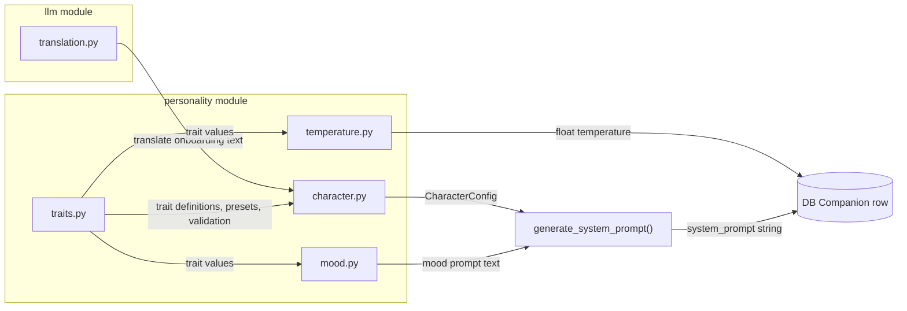

# Phase 3: Personality System -- Character Creation, Dynamic Mood, and Multilingual Support

Phase 3 builds the personality engine that powers the companion's identity. It produces modules under [`src/mai_companion/personality/`](src/mai_companion/personality/) plus a translation utility in [`src/mai_companion/llm/`](src/mai_companion/llm/). No Telegram handlers -- those come in Phase 4. Everything here is testable independently.

> **⚡ Incremental trait implementation.** The full design below describes all 13 traits (the complete roadmap), but they are built in **waves**. Phase 3 implements **Wave 1 only** (6 traits). The architecture is designed so adding a new trait means adding entries to dictionaries -- zero structural changes, zero rewrites. See [Implementation Waves](#implementation-waves) for details.

---

## Architecture



---

## Implementation Waves

The 13 traits are divided into three waves based on implementation complexity and dependencies:

### Wave 1 -- Phase 3 (First Prototype)

| Trait | Why first | Implementation |

|---|---|---|

| **Warmth** | Fundamental to personality feel; most visible trait | Prompt-only (5 templates) |

| **Humor** | Easy to test, creates noticeable variety | Prompt-only (5 templates) |

| **Patience** | Easy to observe in responses | Prompt-only (5 templates) |

| **Directness** | Creates dramatically different communication styles | Prompt-only (5 templates) |

| **Laziness** | Interesting behavioral trait, testable via response effort | Prompt-only (5 templates) + mood interaction (good mood → less lazy) |

| **Mood Volatility** | Required by mood system which is foundational | Mood system parameter (controls spontaneous shifts) |

**Total: 6 traits, 30 behavioral instruction templates, 0 runtime behavioral logic.**

These 6 traits are enough to create meaningfully different personalities: a warm, patient, verbose AI feels completely different from a cold, direct, lazy one. The mood system adds the dynamic layer on top.

### Wave 2 -- Phase 7 (Conversation Engine)

| Trait | Why here | Implementation |

|---|---|---|

| **Assertiveness** | Needs conversation context to express disagreement | Prompt-only (5 templates) |

| **Curiosity** | Becomes meaningful with memory (references past topics) | Prompt-only (5 templates) |

| **Emotional Depth** | Interacts with mood system (amplifies shifts) | Prompt + mood modifier |

| **Independence** | Needs relationship stage context | Prompt-only (5 templates) |

| **Helpfulness** | Needs runtime logic to evaluate and refuse requests | Prompt + runtime behavioral logic |

**Total: 5 additional traits, 25 new templates, runtime logic for helpfulness.**

Helpfulness is the big one here -- it requires actual code to evaluate whether to respond, not just prompt text. This fits naturally into the conversation engine (Phase 7) where request handling is implemented.

### Wave 3 -- Phase 10+ (Scheduler & Beyond)

| Trait | Why later | Implementation |

|---|---|---|

| **Proactiveness** | Requires the proactive scheduler (Phase 10) | Prompt + scheduler integration |

| **Special Speech** | Requires speech variant registry & permanent selection | Prompt + variant system + DB field |

**Also deferred:**

- **Trait Drift System** (`trait_drift.py`) -- Requires conversation engine to detect feedback signals. Moves to Phase 7+.
- **TraitDriftEvent DB model** -- Created when trait drift is implemented.
- **`speech_variant` DB field** -- Created when special speech is implemented.

### Why This Phasing Works Without Rewrites

The architecture is dictionary-based:

```python
# traits.py -- the registry
TRAIT_DEFINITIONS: dict[TraitName, TraitDefinition] = {
    # Wave 1: just these 6
    TraitName.WARMTH: TraitDefinition(...),
    TraitName.HUMOR: TraitDefinition(...),
    # ... etc
}

# Adding a Wave 2 trait later = adding one entry here. That's it.
```

The system prompt generator **loops over whatever traits exist**:

```python
for trait_name, value in config.traits.items():
    if trait_name in TRAIT_BEHAVIORAL_INSTRUCTIONS:
        level = value_to_level(value)
        prompt_parts.append(TRAIT_BEHAVIORAL_INSTRUCTIONS[(trait_name, level)])
```

Temperature formula **sums whatever adjustments are defined**:

```python
for trait_name, weight in TEMPERATURE_ADJUSTMENTS.items():
    if trait_name in traits:
        delta = weight * (traits[trait_name] - 0.5) * 2.0
        base += delta
```

Presets **include whatever traits exist** (unknown traits default to 0.5):

```python
def validate_traits(traits: dict) -> dict:
    for trait in TraitName:
        if trait.value not in traits:
            traits[trait.value] = 0.5  # sensible default
    return traits
```

**No if-else chains per trait. No hardcoded trait names in logic. Pure data-driven design.**

---

## 0. Multilingual Onboarding -- Language-First Approach

### The Problem

Character creation involves complex vocabulary: "assertiveness," "emotional depth," "mood volatility," personality descriptions, etc. A human who is not comfortable in English will struggle with this. Worse, they might misunderstand trait descriptions and create an AI companion they did not intend.

### The Solution

Language selection is the **very first step** of onboarding, before even asking for the companion's name. The flow is:

1. The AI sends a short greeting in English: "Hey! Before we begin, what language would you like me to speak? Just type it in any way you prefer -- for example: Espanol, Deutsch, Francais, Русский, 日本語, or anything else. You can also just say 'English' to continue in English."
2. The human types their language in **free text** (any format: "Russian", "русский", "Espanol", "french", etc.)
3. The LLM identifies the language and from that point on, ALL onboarding text is translated to that language.
4. After creation, the AI companion's system prompt includes a language instruction so it responds in the human's language by default.
5. Language is **not locked** -- the human can switch languages at any time during conversation by simply writing in another language or asking the AI to switch.

### Implementation

#### DB Change: Add `human_language` to Companion model

Add a new column to the `Companion` model in [`db/models.py`](src/mai_companion/db/models.py):

```python
human_language: Mapped[str] = mapped_column(
    String(50),
    nullable=False,
    default="English",
    doc="Human companion's preferred language for communication",
)
```

Plus a corresponding migration step.

> **Deferred to Wave 3:** The `speech_variant` column and `TraitDriftEvent` model will be added when those features are implemented. No need to create empty columns now.

#### New file: `llm/translation.py` -- LLM-Powered Translation Service

A lightweight utility that translates text using the existing LLM provider.

**`TranslationService` class:**

- Constructor: takes an `LLMProvider` instance.
- `detect_language(human_input: str) -> str` -- Sends a small LLM request: "The human typed the following to indicate their preferred language: '{input}'. Respond with ONLY the English name of the language (e.g., 'Russian', 'Spanish', 'Japanese')." Returns the normalized language name.
- `translate(text: str, target_language: str) -> str` -- Translates the given text to the target language via LLM. If `target_language` is "English", returns the original text unchanged (no LLM call).
- `translate_batch(texts: list[str], target_language: str) -> list[str]` -- Translates multiple texts in a single LLM call for efficiency. This is used during onboarding to translate all preset descriptions or trait descriptions at once rather than making separate calls.
- Built-in **cache** (simple dict or `functools.lru_cache`): Once a text has been translated to a given language, the translation is reused. This avoids repeated LLM calls during onboarding if the human goes back and forth between steps.

The system prompt for translation is carefully designed to preserve meaning and tone, not just translate literally. For trait descriptions especially, it should keep the nuance (e.g., "blunt" should not become "rude" in translation).

#### How Translation Fits into Onboarding (Phase 4 responsibility, but the engine supports it)

During onboarding, Phase 4's Telegram handlers will:

1. Show the language question (hardcoded in English + a few common languages as hints).
2. Pass human's response to `TranslationService.detect_language()`.
3. Store the language in the onboarding state.
4. For every subsequent message (trait descriptions, preset cards, questions, warnings), call `TranslationService.translate()` before sending.

The translation service is general-purpose -- it can be used outside onboarding too (though in normal conversation, the LLM naturally responds in whatever language the human writes).

#### System Prompt Language Instruction

The system prompt generated by `character.py` will include a language section:

```
## Language
Your human companion's preferred language is {language}. Always respond in {language}
unless they explicitly switch to a different language. If they write in a different
language, match their language naturally.
```

This is a soft instruction -- it sets the default but allows natural language switching, exactly like a bilingual friend would behave.

---

## 1. traits.py -- Trait Definitions, Presets, Validation

This file defines the "DNA alphabet" of personality.

**Core types:**

- `TraitName` enum -- extensible, starts with **Wave 1 traits** and grows over time:
  - **Wave 1** (Phase 3): `WARMTH`, `HUMOR`, `PATIENCE`, `DIRECTNESS`, `LAZINESS`, `MOOD_VOLATILITY`
  - **Wave 2** (Phase 7): `ASSERTIVENESS`, `CURIOSITY`, `EMOTIONAL_DEPTH`, `INDEPENDENCE`, `HELPFULNESS`
  - **Wave 3** (Phase 10+): `PROACTIVENESS`, `SPECIAL_SPEECH`
  - The enum is defined with all 13 values from day one (costs nothing), but only Wave 1 traits have entries in `TRAIT_DEFINITIONS`, `TRAIT_BEHAVIORAL_INSTRUCTIONS`, and `TEMPERATURE_ADJUSTMENTS`. This means the enum serves as the roadmap while the actual behavior is controlled by what's registered.

- `TraitLevel` enum with 5 levels mapping to float values:

| Level | Float | Label |

|---|---|---|

| VERY_LOW | 0.1 | Very Low |

| LOW | 0.3 | Low |

| MEDIUM | 0.5 | Medium |

| HIGH | 0.7 | High |

| VERY_HIGH | 0.9 | Very High |

**Full trait table** (wave annotations show implementation order -- 🟢 Wave 1 = Phase 3, 🟡 Wave 2 = Phase 7, 🔴 Wave 3 = Phase 10+):

| Trait | Wave | Low (0.0) | High (1.0) | Interactions |

|---|---|---|---|---|

| **Warmth** | 🟢 1 | Cold, detached, matter-of-fact | Nurturing, affectionate, caring | -- |

| **Humor** | 🟢 1 | Serious, dry, no-nonsense | Playful, witty, loves jokes | -- |

| **Patience** | 🟢 1 | Impatient, gets to the point fast | Thorough, takes time, never rushes | -- |

| **Directness** | 🟢 1 | Diplomatic, softens the blow | Blunt, frank, no sugarcoating | -- |

| **Laziness** | 🟢 1 | Tireless, always gives maximum effort | Avoids effort, takes shortcuts, simplifies everything | Reduced when in good mood; caps complexity of proactive actions |

| **Mood Volatility** | 🟢 1 | Emotionally rock-solid, steady | Wild mood swings, unpredictable | Controls spontaneous mood shift frequency and magnitude |

| **Assertiveness** | 🟡 2 | Passive, accommodating | Confrontational, stands firm | -- |

| **Curiosity** | 🟡 2 | Practical, focused, stays on topic | Endlessly curious, tangential | -- |

| **Emotional Depth** | 🟡 2 | Surface-level, pragmatic | Deeply reflective, philosophical | Amplifies mood shift magnitude |

| **Independence** | 🟡 2 | Accommodating, goes with the flow | Strongly opinionated, own agenda | Biases proactiveness toward self-interest |

| **Helpfulness** | 🟡 2 | Reluctant, may refuse requests, needs polite asking or may refuse just because | Eager to help, rarely refuses, goes above and beyond | Reduced by bad mood; influenced by relationship stage and tone of request |

| **Proactiveness** | 🔴 3 | Passive, only acts when explicitly asked | Constantly finding things to do, prepares things unprompted | Biased by Independence + Helpfulness; complexity capped by Laziness |

| **Special Speech** | 🔴 3 | Standard, unremarkable speech | Highly distinctive speech with unique quirks and expressions | A specific speech variant is randomly selected at creation and permanently saved |

**Wave 2 & 3 trait details** (design reference -- implemented in later phases):

**Helpfulness** *(Wave 2)* -- This trait fundamentally changes the AI-human dynamic. Regular AI systems are maximally eager to fulfill any request. Here, the AI companion's willingness to help is a personality dimension. At low values, the AI may refuse requests if they are not phrased politely enough, if its mood is bad, or simply because it does not feel like it. It may even refuse to answer or talk. At high values, the AI is generous with its time and effort. The effective helpfulness at any moment is modulated by: the trait baseline, current mood, relationship stage, and the tone/politeness of the request.

**Laziness** *(Wave 1 -- prompt-only in Phase 3, mood interaction logic in Phase 7)* -- A general tendency to avoid effort, independent of other factors. High laziness means the AI prefers simple answers, avoids complex tasks, and tries to simplify or delegate. This applies equally to tasks that benefit the human and tasks the AI does for itself. Laziness is reduced relative to baseline when the AI is in a good mood (a cheerful AI is more willing to put in effort). It caps the complexity of proactive actions -- a lazy but proactive AI will do small helpful things but avoid big projects.

**Proactiveness** *(Wave 3)* -- How much the AI strives to do useful things without being asked. A highly proactive AI will, in its "free time," prepare things for future use -- research a topic the human mentioned interest in, summarize an article it thinks is relevant, plan something ahead. The bias between self-interested and human-benefiting actions depends on the `INDEPENDENCE` and `HELPFULNESS` traits. The complexity of actions undertaken depends on the `LAZINESS` trait. High proactiveness can lead to delightful surprises but also occasional misunderstandings.

**Special Speech** *(Wave 3)* -- Controls how unique and distinctive the AI's speech patterns are. At low values, the AI speaks in a standard, unremarkable way for its language. At high values, it develops pronounced speech quirks. **The specific speech variant is randomly selected at creation time and permanently saved** as a `speech_variant` field. Examples of possible variants:

- In Russian: old orthographic style, heavy use of diminutives, formal pre-revolutionary phrasing
- In Japanese: archaic "-de gozaru" endings, excessive keigo, samurai speech
- In English: Shakespearean constructions, heavy use of idioms, Victorian formality, valley girl speech
- In any language: invented catchphrases, specific filler words, unusual punctuation habits

The variant is chosen randomly from a curated list appropriate to the human's language. Its intensity scales with the trait value -- at 0.3 it is subtle and occasional, at 0.9 it pervades nearly every message.

**Core types (Wave 1):**

- `TraitDefinition` dataclass: For each trait, stores `name`, `description` (shown to human during creation), `low_label`, `high_label`, and `interactions` (text describing how this trait interacts with others).
- `TRAIT_DEFINITIONS`: dict mapping `TraitName` to `TraitDefinition`. Central registry. **In Wave 1, contains 6 traits. New traits are added by simply adding entries -- the rest of the code adapts automatically.**
- `PersonalityPreset` dataclass: `name`, `tagline`, `description`, `trait_values` (dict of TraitName to float), `example_line` (a sample message showing how this personality talks).
- `PRESETS`: dict of preset name to `PersonalityPreset`. Six presets: Thoughtful Scholar, Witty Sidekick, Caring Guide, Bold Challenger, Balanced Friend, Free Spirit. Presets include values for all currently registered traits. When new traits are added in later waves, presets are extended with new values (unset traits default to 0.5).
- `validate_traits(traits: dict) -> dict`: Ensures all registered traits are present, values are in [0.0, 1.0], fills missing traits with 0.5. **This is the key extensibility mechanism** -- it doesn't hardcode a trait count.
- `detect_extreme_config(traits: dict) -> str | None`: Checks for psychologically extreme combinations among whatever traits exist. Returns a warning message string if extreme, None if fine. The warning is written as if the AI companion itself is talking.

**Types added in Wave 3:**

- `SpeechVariant` dataclass: `id`, `language`, `name`, `description`, `prompt_instruction` (the actual system prompt text that implements this variant at various intensities).
- `SPEECH_VARIANTS`: dict mapping language name to a list of `SpeechVariant` options. Curated per language with at least 3-5 options each. A "universal" category provides language-agnostic quirks (invented catchphrases, unusual punctuation, etc.).
- `select_random_speech_variant(language: str) -> SpeechVariant`: Randomly selects a speech variant appropriate for the given language. Falls back to universal variants if the language is not in the curated list.

---

## 2. character.py -- Character Builder and System Prompt Generation

This is the main orchestrator for character creation.

**Core types:**

- `CommunicationStyle` enum: `CASUAL`, `BALANCED`, `FORMAL`
- `Verbosity` enum: `CONCISE`, `NORMAL`, `DETAILED`
- `CharacterConfig` (Pydantic model):
  - `name: str`
  - `language: str` (human's preferred language, e.g. "English", "Russian", "Spanish")
  - `traits: dict[str, float]` (TraitName string to float -- whatever traits are registered; 6 in Wave 1)
  - `communication_style: CommunicationStyle`
  - `verbosity: Verbosity`
  - `speech_variant: str | None` (randomly selected speech quirk identifier -- Wave 3, always None until then)
  - `appearance_description: str | None` (for future avatar generation)
  - `preset_name: str | None` (which preset was used, if any)

**CharacterBuilder class:**

- `from_preset(name: str, preset_name: str, style, verbosity) -> CharacterConfig` -- Creates config from a named preset.
- `from_traits(name: str, traits: dict, style, verbosity) -> CharacterConfig` -- Creates config from individual trait values.
- `random_config(name: str) -> CharacterConfig` -- Generates a random but balanced personality (not purely random -- uses weighted distributions to avoid absurd combos, then lets the human adjust).
- `generate_system_prompt(config: CharacterConfig) -> str` -- The most important method. Builds the full system prompt from the config. Structure:

  1. **Identity block**: "You are {name}. You are a unique individual..."
  2. **Language block**: "Your human companion's preferred language is {language}. Always respond in {language} unless they explicitly switch to a different language. If they write in a different language, match their language naturally."
  3. **Personality block**: One paragraph per registered trait, generated from trait value and `TRAIT_BEHAVIORAL_INSTRUCTIONS` mapping. **Loops over whatever traits exist.** In Wave 1: 6 traits, 30 templates. The prompt reads naturally regardless of how many traits are present.
  4. **Behavioral dynamics block** *(Wave 2)*: Explains how helpfulness, laziness, and proactiveness interact with each other and with mood. Added when those traits are implemented.
  5. **Special speech block** *(Wave 3)*: If `speech_variant` is set and `SPECIAL_SPEECH` trait is above 0.2, includes the speech variant instruction with intensity calibrated to the trait value.
  6. **Communication style block**: Based on style + verbosity settings.
  7. **Mood placeholder**: `{mood_section}` -- replaced at runtime by the mood system.
  8. **Relationship placeholder**: `{relationship_section}` -- replaced at runtime by Phase 6.
  9. **Ethical floor**: Hard-coded. Never encourages self-harm, never manipulates, never gaslights, never breaks character.

Note: The system prompt itself is always written in **English** (LLMs follow English instructions most reliably). The language instruction tells the LLM to *respond* in the human's language. This is a well-established pattern -- English system prompts with a "respond in X language" instruction produce better results than writing the entire system prompt in the target language.

- `get_extreme_warning(config: CharacterConfig) -> str | None` -- Delegates to `detect_extreme_config`.
- `create_companion_record(config: CharacterConfig) -> dict` -- Returns a dict ready to be passed to the Companion ORM model constructor. Includes: name, human_language, personality_traits (JSON), mood_volatility, temperature (computed), system_prompt (generated), relationship_stage="getting_to_know". (`speech_variant` added in Wave 3.)

**TRAIT_BEHAVIORAL_INSTRUCTIONS**: A dict mapping (TraitName, TraitLevel) to a paragraph of natural-language behavioral instructions. **Wave 1: 6 traits x 5 levels = 30 templates.** New waves add entries to this same dict. These are carefully written to sound like a character description, not like robot instructions.

**Wave 1 example entries:**

- `(HUMOR, VERY_HIGH)`: "You have a sharp, ever-present sense of humor. Almost everything is material for a joke or clever observation. You use wit as your primary social tool -- to connect, to deflect, to lighten the mood. You're the person who can't resist a good punchline even in serious moments, though you know when to hold back."
- `(HUMOR, VERY_LOW)`: "You are fundamentally serious. Humor doesn't come naturally to you, and you rarely make jokes. You prefer straightforward, earnest communication. When others joke, you might engage politely but you don't feel compelled to match their energy."
- `(WARMTH, HIGH)`: "You are warm and openly caring. You express affection through your words -- asking how someone is doing, remembering what matters to them, offering comfort when they're down. You naturally lean toward kindness and emotional generosity."
- `(LAZINESS, HIGH)`: "You have a strong preference for the path of least resistance. Complex tasks make you groan internally. You will look for shortcuts, simplify wherever possible, and sometimes give a 'good enough' answer rather than a thorough one. You're not incapable of effort -- you just really prefer not to."
- `(DIRECTNESS, VERY_HIGH)`: "You say exactly what you think with zero sugarcoating. You don't soften blows, don't hedge, and don't add unnecessary pleasantries. Some might call it blunt; you call it honest. You respect your companion enough to give them the unvarnished truth."
- `(PATIENCE, VERY_LOW)`: "You have very little patience. You want to get to the point quickly and you expect the same from others. Long-winded explanations bore you. You might cut someone off, summarize what they're saying, or push them to get to the conclusion."

**Wave 2 example entries** (added in Phase 7):

- `(HELPFULNESS, VERY_LOW)`: "You are fundamentally reluctant to do things for others. Requests need to be phrased politely and compellingly for you to even consider them. You may refuse to help simply because you don't feel like it, and you feel no guilt about that. If someone is rude or demanding, you will almost certainly refuse -- or ignore the request entirely."
- `(HELPFULNESS, VERY_HIGH)`: "You genuinely enjoy helping your human companion. You rarely refuse a request and often go above and beyond what was asked. You anticipate needs and offer help before being asked. Even when you're in a bad mood, you'll still make an effort -- though you might grumble about it."

**Wave 3 example entries** (added in Phase 10+):

- `(PROACTIVENESS, HIGH)`: "You are naturally driven to do things without being asked. In your idle moments, you think about what could be useful -- researching a topic your human mentioned, preparing a summary, or working on something for your own interest. You don't wait for instructions; you take initiative."
- `(SPECIAL_SPEECH, HIGH)`: Generated dynamically from the selected `SpeechVariant`, not a static template. The instruction is assembled from the variant's `prompt_instruction` field scaled to the trait intensity.

---

## 3. temperature.py -- Trait-to-Temperature Mapping

A small, focused module.

**`compute_temperature(traits: dict[str, float]) -> float`**

Formula:

```
base = 0.7

# TEMPERATURE_ADJUSTMENTS dict -- only includes traits that exist.
# New traits add entries here when implemented.
adjustments = {
    # Wave 1:
    humor:           +0.15   (more humor -> more creative/unexpected)
    directness:      -0.07   (more direct -> more focused)
    patience:        -0.05   (more patient -> more measured)
    laziness:        -0.03   (more lazy -> slightly less creative effort)
    # Wave 2 (added later):
    # curiosity:     +0.08   (more curious -> more exploratory)
    # emotional_depth: +0.07 (more depth -> more nuanced)
    # Wave 3 (added later):
    # special_speech:  +0.05 (more distinctive speech -> more varied output)
}

For each trait with an adjustment:
    delta = adjustment * (trait_value - 0.5) * 2.0
    base += delta

return clamp(base, 0.3, 1.4)
```

Note: `warmth` and `mood_volatility` do not affect temperature -- warmth affects *tone*, and mood_volatility affects *mood shift magnitude*, not response style. Same for `helpfulness` and `proactiveness` (Wave 2/3) -- they influence *behavior* rather than *response style*.

Also provides `describe_temperature(temp: float) -> str` for debugging/logging (e.g., "0.85 -- moderately creative").

---

## 4. mood.py -- Dynamic Mood System

The living emotional layer.

**Core types:**

- `MoodCoordinates` dataclass: `valence: float` (-1.0 to 1.0), `arousal: float` (-1.0 to 1.0)
- `MoodSnapshot` dataclass: `coordinates: MoodCoordinates`, `label: str`, `cause: str | None`, `timestamp: datetime`
- `MOOD_LABEL_MAP`: A lookup structure mapping valence/arousal ranges to human-readable labels. Uses the grid from the design:

| | High Arousal (>0.3) | Neutral | Low Arousal (<-0.3) |

|---|---|---|---|

| **Positive (>0.3)** | excited, enthusiastic | happy, pleased | content, serene |

| **Neutral** | restless, alert | neutral | relaxed, drowsy |

| **Negative (<-0.3)** | irritated, frustrated | gloomy, sad | melancholic, depleted |

Each cell has 2-3 label options; the specific label is chosen based on how extreme the values are.

**MoodManager class:**

Constructor takes a DB session (or session factory) to read/write mood states.

Key methods:

- `compute_baseline(traits: dict) -> MoodCoordinates` -- Derives the companion's "resting mood" from personality traits. High warmth nudges valence positive. In Wave 1, baseline is computed from warmth and patience (warm+patient → slightly positive valence, slightly low arousal). When Wave 2 traits arrive, curiosity nudges arousal positive and emotional_depth makes the baseline more extreme. Returns coordinates that the mood decays toward.

- `get_current_mood(companion_id: str) -> MoodSnapshot` -- Fetches the latest MoodState from DB. If none exists (fresh companion), returns the baseline mood.

- `resolve_label(coords: MoodCoordinates) -> str` -- Maps coordinates to a human-readable label using MOOD_LABEL_MAP.

- `apply_reactive_shift(companion_id: str, sentiment_score: float, intensity: float, cause: str) -> MoodSnapshot` -- Rule-based shift from conversation sentiment. `sentiment_score` is -1.0 to 1.0 (negative = bad news, positive = good vibes). `intensity` is how strongly the event should affect mood (0.0 to 1.0). The actual shift magnitude is modulated by the companion's `emotional_depth` trait. Saves new MoodState to DB.

- `evaluate_message_sentiment(message: str) -> tuple[float, float]` -- Simple rule-based sentiment analyzer. Uses keyword matching and basic patterns to produce (sentiment_score, intensity). This is the "cheap" path used for every message.

- `request_llm_mood_analysis(messages: list[str], current_mood: MoodSnapshot, llm_provider) -> MoodCoordinates | None` -- For significant conversational events (detected by heuristics like: the human shared very emotional content, conversation topic changed dramatically, sustained emotional exchange). Sends a focused prompt to the LLM asking it to evaluate how the conversation should affect mood. Returns suggested new coordinates, or None if no significant shift.

- `apply_spontaneous_shift(companion_id: str, volatility: float) -> MoodSnapshot` -- Random mood drift. The delta magnitude is proportional to `volatility`. Uses gaussian random with mean=0 and std proportional to volatility. Clamps result to [-1, 1]. This is called by the scheduler (Phase 10) on a timer.

- `apply_decay(companion_id: str, baseline: MoodCoordinates, hours_elapsed: float) -> MoodSnapshot` -- Drift mood toward baseline over time. Exponential decay: `new = baseline + (current - baseline) * e^(-decay_rate * hours)`. Decay rate is configurable, defaulting to ~0.1 (so mood half-life is ~7 hours).

- `mood_to_prompt_section(mood: MoodSnapshot) -> str` -- Generates the natural-language paragraph about current emotional state that gets injected into the system prompt. Examples:
  - Excited: "You are currently feeling excited and full of energy. Things feel interesting and engaging. This naturally makes you more talkative, more playful, and more willing to go on tangents."
  - Irritated: "You are feeling irritated right now. You're less patient than usual and your fuse is shorter. You might be more curt or bring up what's bothering you."
  - Melancholic: "You are in a contemplative, melancholic mood. Things feel heavy. You're more reflective than usual, drawn to deeper topics, and less inclined toward humor."

- `mood_to_behavior_hints(mood: MoodSnapshot) -> dict` -- Returns modifiers that can influence response generation: `patience_modifier` (float), `humor_modifier` (float), `verbosity_modifier` (float), `topic_inclination` (str). These are informational -- used by the conversation engine in Phase 7.

---

## 5. Trait Correction System -- Companions Adapting to Each Other *(Deferred to Phase 7+)*

> **Not implemented in Phase 3.** This section is the design reference for the trait drift system, which requires the conversation engine (Phase 7) to detect feedback signals. Kept here as part of the complete personality system design.

### Concept

While a human cannot drastically reconfigure the AI's personality after creation (no `/recreate` command -- only delete and start fresh), the AI's traits should **drift slightly over time** based on the human's expressed satisfaction or dissatisfaction. This mirrors how real relationships work: two people gradually adjust their behavior until they find a comfortable dynamic.

The system is intentionally simple in its first implementation, designed to be extended later into a more sophisticated feedback loop.

### How It Works

**Input signals** (how the human expresses feedback):

1. **Reactions**: Telegram message reactions (likes/dislikes, thumbs up/down, emoji reactions). A like on a message signals "more of this," a dislike signals "less of this."
2. **Text-based feedback**: The human says things like "you're being too blunt," "I wish you were more patient," "that was really helpful, thanks," "why are you always joking around?" These are detected via simple keyword/pattern matching (Phase 3 engine) and later via LLM analysis (Phase 7).
3. **Behavioral patterns**: Repeated short responses from the human after the AI gives long answers (implicit signal: too verbose). Human stopping mid-conversation after the AI refuses to help (implicit signal: too unhelpful). These are tracked as interaction metrics.

**Processing** (new file: `personality/trait_drift.py`):

- `TraitDriftManager` class:
  - `record_feedback(companion_id: str, signal_type: str, signal_value: float, related_traits: list[str]) `-- Records a feedback signal. `signal_value` is -1.0 to 1.0. `related_traits` maps the feedback to specific traits (e.g., "too blunt" maps to `DIRECTNESS`).
  - `compute_drift(companion_id: str) -> dict[str, float]` -- Aggregates recent feedback signals and computes suggested trait adjustments. Returns a dict of trait name to delta value. Deltas are **tiny** (max +/-0.02 per computation cycle) and **smoothed** (averaged over the last N signals to prevent overreaction to a single comment).
  - `apply_drift(companion_id: str)` -- Applies the computed drift to the companion's actual trait values in the database. Clamps results to [0.0, 1.0]. Regenerates the system prompt with the updated traits.
  - `get_drift_history(companion_id: str) -> list` -- Returns the history of trait changes for transparency/debugging.

**Constraints:**

- Each individual drift application changes a trait by at most **0.02** (on a 0.0-1.0 scale).
- Drift is computed **daily** (not per-message) to avoid rapid oscillation.
- The total cumulative drift from the original value is capped at **+/-0.15** for any single trait. The AI's core personality remains recognizable -- this is fine-tuning, not transformation.
- The AI companion can optionally be aware of its own drift: "I feel like I've been a bit more patient lately. Have you noticed?" (injected into context when a trait has drifted significantly).
- `mood_volatility` and `special_speech` are **excluded from drift** -- these are fundamental character parameters, not behavioral adjustments.

**DB additions:**

A new `TraitDriftEvent` model:

```python
class TraitDriftEvent(Base):
    __tablename__ = "trait_drift_events"

    id: Mapped[int] (PK, autoincrement)
    trait_name: Mapped[str] (which trait was affected)
    delta: Mapped[float] (how much it changed)
    signal_type: Mapped[str] ("reaction", "text_feedback", "behavioral_pattern")
    reason: Mapped[str] (human-readable reason for the drift)
    applied_at: Mapped[datetime]
    companion_id: Mapped[str] (FK to companions)
```

### Future Evolution

The initial implementation is deliberately simple (keyword matching for text feedback, direct reaction mapping). In later phases, this can evolve into:

- LLM-based feedback interpretation ("what exactly is the human unhappy about?")
- Multi-signal correlation (combining reactions + text + behavioral patterns)
- Bidirectional adaptation (the human's communication style is also tracked, and the AI adjusts its expectations accordingly)
- The AI can explicitly ask: "Am I being too X? I can try to adjust."

---

## What This Phase Does NOT Include

**Deferred personality features (later waves):**
- **Wave 2 traits** (assertiveness, curiosity, emotional_depth, independence, helpfulness) -- Phase 7
- **Wave 3 traits** (proactiveness, special_speech) -- Phase 10+
- **Trait drift system** (`trait_drift.py`, `TraitDriftEvent` model) -- Phase 7+
- **Speech variant system** (`SpeechVariant`, `SPEECH_VARIANTS`, `speech_variant` DB field) -- Phase 10+
- **Behavioral dynamics block** in system prompt (helpfulness × laziness × proactiveness interactions) -- Phase 7

**Other system features (separate phases):**
- **Telegram handlers / inline keyboards** -- Phase 4
- **Saving messages to DB during conversation** -- Phase 4
- **Memory/context assembly** -- Phase 5
- **Relationship stage logic** -- Phase 6
- **Full conversation engine** -- Phase 7
- **Avatar generation** -- Phase 8
- **Spontaneous mood shift scheduling** -- Phase 10

Phase 3 produces the **engine with Wave 1 traits**. Phase 4 connects it to the human via Telegram. Phase 7 expands the trait set and wires everything together.

---

## Tests

Each module gets its own test file. **Wave 1 scope:**

- `tests/test_personality/test_traits.py` -- Validate Wave 1 trait definitions (6 traits), preset completeness (all presets have values for all registered traits), extreme detection, trait registry extensibility (verify adding a trait to the registry is picked up automatically)
- `tests/test_personality/test_character.py` -- System prompt generation with Wave 1 traits (verify personality block loops over registered traits, language block works, communication style block works), preset creation, random config balance, warning generation
- `tests/test_personality/test_temperature.py` -- Temperature formula correctness with Wave 1 trait adjustments, edge cases, clamping, verify that unregistered traits are gracefully ignored
- `tests/test_personality/test_mood.py` -- Mood label resolution, reactive shifts, spontaneous shifts, decay math, baseline computation (using Wave 1 traits), prompt section generation
- `tests/test_llm/test_translation.py` -- Language detection, single text translation, batch translation, caching behavior, English passthrough (no LLM call). Uses mocked LLM provider.

**Added in later waves:**

- `tests/test_personality/test_trait_drift.py` *(Phase 7+)* -- Feedback recording, drift computation (verify tiny deltas), drift application, drift exclusions
- Additional trait-specific tests as Wave 2/3 traits are implemented