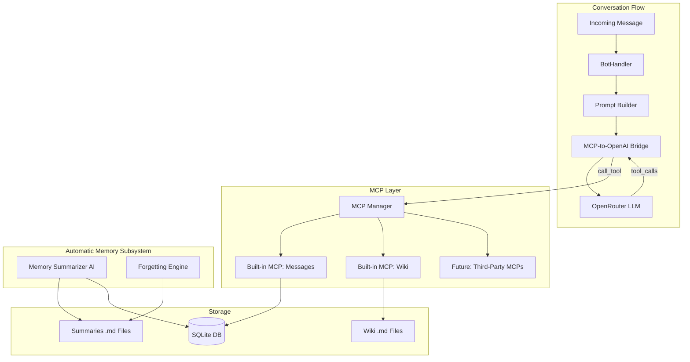
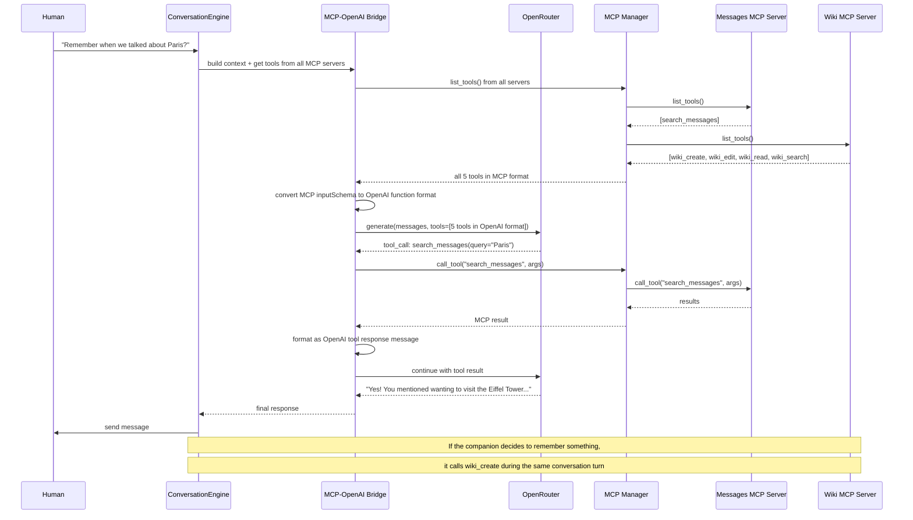

# Phase 5: Memory System -- The Brain (Revised Detailed Plan)

## Corrected Phase 5 Text (Grammar Fixes)

> 1. **Short-term memory**: Recent 30 messages (sliding window) included directly in context. And always all today's messages. But all messages are stored forever and could be accessed using a built-in MCP (see below).

> 2. **Summaries**: At the end of each day (or when a threshold is reached), the parallel AI memory subsystem (not the same as the AI companion) compresses the day's conversation into a concise summary. Stored as \*.md files. After the end of each week -- weekly summaries. Then monthly summaries. All summaries are automatically included in context (yes, this could be costly, but we need this quality of memory to achieve a great experience).

> 3. **Messages search**: When the human references something from the past, the AI could use a messages tool to search exactly what happened in its messages history using keyword search (like humans do using their messenger's history). Let's implement this as a built-in MCP (with the possibility of adding other MCPs in the future). Let's use only models with native tool support.

> 4. **Knowledge base (wiki)**: Structured facts about the human and the AI extracted from conversations by the AI companion itself -- name, preferences, important dates, opinions, life events, etc. Stored as key-value entries in a wiki folder with **importance scores (e.g. 9999\_human\_name.md)**; 20 most important things are always included in context. The AI can create/edit/read/search entries using another built-in MCP -- wiki tools. Of course, the human can ask the AI to add some important information to its wiki.

> 5. **Graceful forgetting**: The parallel AI memory subsystem summarizes old entries into less verbose ones. For example, after 4 weeks a monthly summary will be created with more condensed information about what happened during those weeks, and the weekly memories will be deleted. Thus low-importance facts fade ("You mentioned preferring Thai food at some point" instead of "On March 15th you said..."). High-importance facts (human's name, family members, major life events) persist forever in the wiki and even in very condensed memory (because the subsystem understands their importance).

---

## Two Kinds of Memory: Conscious vs. Automatic

This is the central architectural distinction of Phase 5:

| Aspect | Wiki (Conscious Memory) | Summaries (Automatic Memory) |

|---|---|---|

| Who manages it | The AI companion itself, during conversation | The parallel AI memory subsystem (background) |

| When it runs | During conversation, via MCP tool calls | End of day / on schedule / on threshold |

| Personality | Uses the companion's full personality and judgment | Uses a neutral summarizer prompt |

| What it stores | Deliberate facts: names, preferences, dates, opinions | Compressed conversation history |

| How it decides | The companion chooses what matters | Automatic: all conversations get summarized |

| Human interaction | Human can ask the companion to remember something | Invisible to the human |

---

## Architecture Overview



---

## Message Search: Why LIKE Instead of FTS5

**The problem with FTS5:** SQLite's FTS5 `unicode61` tokenizer splits text on whitespace and punctuation. CJK languages (Chinese, Japanese, Korean) do not use spaces between words. The string "前言你好世界" is treated as a single token, so searching for "你好" returns nothing. This is a confirmed, well-documented limitation (see Signal iOS issue #6169, multiple SQLite forum threads).

**Available alternatives:**

| Approach | CJK Support | Complexity | Performance | Dependencies |

|---|---|---|---|---|

| FTS5 `unicode61` | Broken for CJK | Medium | Fast | None |

| FTS5 `trigram` | Works (character-level) | Medium | Fast, but large index | SQLite 3.34+ |

| FTS5 + ICU tokenizer | Full support | High (C extension) | Fast | ICU library (C) |

| SQL `LIKE '%query%'` | Universal | Minimal | Slower on huge tables | None |

**Our choice: `LIKE` search.** For a single-user companion with thousands (not millions) of messages, `LIKE` is perfectly adequate. It works with every language, every script, every character set. No special dependencies, no C extensions, no tokenizer configuration. A query like `WHERE content LIKE '%query%'` on 10,000 messages takes milliseconds on SQLite. We search newest-first (ORDER BY id DESC) and limit results (LIMIT 20), so even with growth over years, performance remains acceptable.

**If performance ever becomes an issue** (years of daily use), we can add the FTS5 `trigram` tokenizer as an optimization -- it works for CJK by indexing character trigrams. But this is a future optimization, not a Phase 5 requirement.

---

## MCP Architecture

We use the official `mcp` Python SDK (PyPI package: `mcp`) to implement real MCP servers.

### How It Works



### MCP Manager: Loading and Managing MCP Servers

The `MCPManager` is the central piece that:

1. Loads built-in MCP servers (messages, wiki) at startup
2. In the future, loads third-party MCP servers from configuration
3. Aggregates tools from all servers into a single list
4. Routes `call_tool()` requests to the correct server
5. Converts between MCP tool format and OpenAI function-calling format

**Third-party MCP support (future):** Because our built-in tools follow the real MCP protocol, adding third-party MCPs later is straightforward. The config would specify external MCP servers (stdio command or HTTP URL), the MCPManager connects to them, and their tools automatically appear alongside our built-in ones.

---

## Directory Structure for Memory Data

```
data/{companion_id}/
  summaries/
    daily/
      2026-02-14.md
      2026-02-13.md
    weekly/
      2026-W07.md
    monthly/
      2026-01.md
  wiki/
    9999_human_name.md
    9500_human_birthday.md
    9000_family_sister_anna.md
    5000_favorite_food.md
    3000_mentioned_trip_to_paris.md
```

---

## Step-by-Step Implementation

### Step 1: Extend LLM Provider with Tool-Calling Support

**Files:** [src/mai_companion/llm/provider.py](src/mai_companion/llm/provider.py), [src/mai_companion/llm/openrouter.py](src/mai_companion/llm/openrouter.py)

The current provider has no support for tools. We need to add it because OpenRouter speaks the OpenAI tool-calling format, which is how the LLM communicates tool requests.

**New data classes in `provider.py`:**

- `ToolDefinition`: `name`, `description`, `parameters` (JSON Schema dict)
- `ToolCall`: `id`, `name`, `arguments` (JSON string)
- Add `TOOL = "tool"` to `MessageRole` enum
- Extend `ChatMessage`: add optional `tool_calls: list[ToolCall] | None `and `tool_call_id: str | None`
- Extend `LLMResponse`: add `tool_calls: list[ToolCall]`

**Changes to `generate()` and `generate_stream()` signatures:**

- Add `tools: list[ToolDefinition] | None = None` parameter
- Add `tool_choice: str | None = None` parameter ("auto", "none", or specific name)

**Changes to `OpenRouterProvider`:**

- `_build_payload()`: when `tools` is provided, include `"tools"` array in OpenAI format:
  ```python
  {"type": "function", "function": {"name": ..., "description": ..., "parameters": ...}}
  ```

- `_parse_response()`: extract `tool_calls` from `choices[0].message.tool_calls` when present
- Handle the case where the response has `tool_calls` but no `content` (or both)

---

### Step 2: Built-in MCP Server -- Messages Search

**Files:** new `src/mai_companion/mcp_servers/__init__.py`, new `src/mai_companion/mcp_servers/messages_server.py`

**New dependency:** Add `mcp>=1.0` to `pyproject.toml`

Implements a real MCP server using the `mcp` Python SDK with one tool:

**Tool: `search_messages`**

- Description: "Search your conversation history by keywords. Use this when you need to recall what was said about a specific topic. Works like searching in a messenger app."
- Parameters: `query` (string, required), `limit` (integer, default 20, max 50)
- Implementation: SQL `LIKE '%{query}%'` on the messages table, ordered by `id DESC`, limited to N results
- Returns: formatted list of messages with timestamps and roles, e.g.:
  ```
  [2026-02-10 14:23] Human: I'm thinking about visiting Paris next summer
  [2026-02-10 14:24] You: Oh, Paris! That sounds amazing...
  ```


**MessageStore class** (internal, used by the MCP server):

- `save_message(companion_id, role, content, is_proactive) -> Message`
- `get_short_term(companion_id, limit=30) -> list[Message]` -- recent 30 + all today, deduplicated
- `search(companion_id, query, limit=20) -> list[Message] `-- `LIKE` search
- `get_messages_for_date(companion_id, date) -> list[Message]` -- for summarization
- `get_messages_in_range(companion_id, start, end) -> list[Message]`

The MCP server holds a reference to the `MessageStore` and the current `companion_id`.

---

### Step 3: Built-in MCP Server -- Wiki

**Files:** new `src/mai_companion/mcp_servers/wiki_server.py`

Implements a real MCP server with four tools. These tools are used by the companion itself during conversation -- the companion decides when and what to remember.

**Tool: `wiki_create`**

- Description: "Save a new piece of knowledge to your personal wiki. Use this when you learn something important about your human or want to remember something. Choose importance carefully: 9999 = human's name, 9000+ = family/close relationships, 8000+ = major life events, 7000+ = important dates, 5000+ = strong preferences and hobbies, 3000+ = casual preferences, 1000+ = minor details."
- Parameters: `key` (string, required -- a short descriptive title), `content` (string, required), `importance` (integer 0-9999, required)
- Implementation: writes `{importance:04d}_{sanitized_key}.md` to the wiki directory; also creates a `KnowledgeEntry` DB record for metadata tracking

**Tool: `wiki_edit`**

- Description: "Update an existing wiki entry with new or corrected information."
- Parameters: `key` (string, required), `content` (string, required), `importance` (integer, optional -- if provided, updates the score and renames the file)

**Tool: `wiki_read`**

- Description: "Read a specific entry from your wiki by its key."
- Parameters: `key` (string, required)

**Tool: `wiki_search`**

- Description: "Search your wiki for entries matching a query. Searches both keys and content."
- Parameters: `query` (string, required)
- Implementation: `LIKE` search across file names and file content

**WikiStore class** (internal, used by the MCP server):

- `create_entry(companion_id, key, content, importance) -> WikiEntry`
- `edit_entry(companion_id, key, content, importance=None) -> WikiEntry`
- `read_entry(companion_id, key) -> str | None`
- `search_entries(companion_id, query) -> list[WikiEntry]`
- `get_top_entries(companion_id, limit=20) -> list[WikiEntry]`
- `list_entries(companion_id) -> list[WikiEntry]`
- `delete_entry(companion_id, key)`
- `decay_importance(companion_id, key, amount)` -- for forgetting

**WikiEntry dataclass:** `key: str`, `content: str`, `importance: int`, `file_path: Path`

**File naming:** Keys are sanitized (lowercase, spaces to underscores, special chars removed). Files are `{importance:04d}_{key}.md` with UTF-8 encoding and a small YAML front matter for debugging.

---

### Step 4: MCP Manager and OpenAI Bridge

**Files:** new `src/mai_companion/mcp_servers/manager.py`, new `src/mai_companion/mcp_servers/bridge.py`

The MCP Manager aggregates multiple MCP servers. The Bridge converts between MCP and OpenAI formats.

**MCPManager:**

- `register_server(name, mcp_server)` -- registers a built-in MCP server
- `async list_all_tools() -> list[mcp.types.Tool]` -- aggregates tools from all servers
- `async call_tool(server_name, tool_name, arguments) -> result` -- routes to correct server
- Future: `connect_external_server(command_or_url)` -- connects to third-party MCP servers

**MCPBridge:**

- `mcp_tools_to_openai(mcp_tools) -> list[ToolDefinition] `-- converts MCP `inputSchema` to OpenAI function format
- `openai_tool_call_to_mcp(tool_call: ToolCall) -> (server_name, tool_name, arguments)` -- routes an OpenAI tool call to the right MCP server
- `mcp_result_to_openai(result) -> str` -- formats MCP tool result as a string for the OpenAI tool response message
- `async run_with_tools(llm, messages, mcp_manager, max_iterations=5) -> LLMResponse` -- the agentic loop:

                                                                                                                                                                                                                                                                                                                                                                                                                                                                                                                                1. Get all tools from MCPManager, convert to OpenAI format
                                                                                                                                                                                                                                                                                                                                                                                                                                                                                                                                2. Call LLM with messages + tools
                                                                                                                                                                                                                                                                                                                                                                                                                                                                                                                                3. If response has `tool_calls`: execute each via MCPManager, append results
                                                                                                                                                                                                                                                                                                                                                                                                                                                                                                                                4. Re-call LLM with updated history
                                                                                                                                                                                                                                                                                                                                                                                                                                                                                                                                5. Repeat until LLM returns text or max iterations reached

---

### Step 5: File-Based Summary Storage

**Files:** new `src/mai_companion/memory/summaries.py`

**SummaryStore class:**

- `save_daily(companion_id, date, content) -> Path`
- `save_weekly(companion_id, week_id, content) -> Path`
- `save_monthly(companion_id, month_id, content) -> Path`
- `get_all_summaries(companion_id) -> list[SummaryEntry]` -- all summaries, chronologically sorted (monthly first, then weekly, then daily)
- `delete_daily(companion_id, date)` / `delete_weekly(companion_id, week_id)`
- `list_dailies(companion_id) -> list[date]`

**SummaryEntry dataclass:** `type` ("daily"/"weekly"/"monthly"), `period` (date string), `content`

Files are stored as `data/{companion_id}/summaries/{type}/{period}.md` with UTF-8 encoding. Auto-creates directories on first use.

---

### Step 6: Summary Generation (Automatic Memory Subsystem)

**Files:** new `src/mai_companion/memory/summarizer.py`

This is the "parallel AI memory subsystem" -- a background process that uses a **neutral summarizer prompt** (NOT the companion's personality).

**MemorySummarizer class:**

- System prompt:
  ```
  You are a memory management subsystem. Your job is to create concise,
  accurate summaries of conversations. Focus on: key topics discussed,
  emotional tone and significant moments, promises or commitments made,
  new information learned about either companion, unresolved topics.
  Write in the same language as the conversation. Be factual and concise.
  Do NOT add personality or opinions -- just summarize what happened.
  ```

- `generate_daily_summary(companion_id, date) -> str` -- fetches messages for the date, calls LLM, saves via SummaryStore
- `generate_weekly_summary(companion_id, week_id) -> str` -- condenses daily summaries into weekly
- `generate_monthly_summary(companion_id, month_id) -> str` -- condenses weekly summaries into monthly
- Threshold trigger: if messages since last summary exceed N (configurable, default 50), generate interim summary

---

### Step 7: Graceful Forgetting Engine

**Files:** new `src/mai_companion/memory/forgetting.py`

**ForgettingEngine class:**

- `run_forgetting_cycle(companion_id)`:

                                                                                                                                                                                                                                                                                                                                                                                                                                                                                                                                1. **Weekly consolidation:** Daily summaries older than 7 days without a corresponding weekly -> group by ISO week -> generate weekly summary -> delete consumed dailies
                                                                                                                                                                                                                                                                                                                                                                                                                                                                                                                                2. **Monthly consolidation:** Weekly summaries older than 4 weeks without a corresponding monthly -> group by month -> generate monthly summary -> delete consumed weeklies
                                                                                                                                                                                                                                                                                                                                                                                                                                                                                                                                3. **Wiki importance decay:** Wiki entries not updated in 30+ days with importance below 3000 -> reduce importance by 100. Entries reaching 0 are deleted.

- Condensation prompt for the summarizer:
  ```
  Condense these summaries into a single, more compact summary.
  Preserve: names, relationships, major events, emotional milestones, promises.
  Let go of: specific dates (use "around that time"), exact quotes (paraphrase),
  minor conversational details.
  ```


---

### Step 8: Prompt Builder

**Files:** new `src/mai_companion/core/prompt_builder.py`

Moves and extends the prompt-building logic from `BotHandler._build_full_prompt()`.

**PromptBuilder class:**

- `build_context(companion, mood, message_text) -> list[ChatMessage]`:

                                                                                                                                                                                                                                                                                                                                                                                                                                                                                                                                1. **System prompt** -- personality + mood + relationship stage (existing logic from handler)
                                                                                                                                                                                                                                                                                                                                                                                                                                                                                                                                2. **Wiki section** -- "## Things you know\n" + top 20 wiki entries as bullet points:
     ```
     - **human_name**: Alex (importance: 9999)
     - **human_birthday**: March 15, 1995 (importance: 9500)
     ```

                                                                                                                                                                                                                                                                                                                                                                                                                                                                                                                                1. **Summaries section** -- "## Your memories\n" + all summaries chronologically (monthly, weekly, daily)
                                                                                                                                                                                                                                                                                                                                                                                                                                                                                                                                2. **Short-term messages** -- recent 30 + all today's messages, deduplicated, oldest first

- **Token budget management:** count tokens for each section. If total exceeds model context limit (configurable, default 120k tokens), truncate oldest monthly summaries first. Log warnings when approaching limits.

---

### Step 9: Memory Manager (Orchestrator)

**Files:** new `src/mai_companion/memory/manager.py`

Single entry point for all memory operations. Coordinates between MessageStore, SummaryStore, WikiStore, and the summarizer.

- `save_message(...)` -- delegates to MessageStore
- `get_short_term_messages(...)` -- delegates to MessageStore
- `get_all_summaries(...)` -- delegates to SummaryStore
- `get_wiki_top(...)` -- delegates to WikiStore
- `trigger_daily_summary(companion_id, date)` -- calls MemorySummarizer
- `run_forgetting_cycle(companion_id)` -- calls ForgettingEngine

Note: The MemoryManager does NOT manage wiki writes -- that is the companion's job via MCP tools during conversation.

---

### Step 10: Integration

**Files:** [src/mai_companion/bot/handler.py](src/mai_companion/bot/handler.py), [src/mai_companion/main.py](src/mai_companion/main.py), [src/mai_companion/config.py](src/mai_companion/config.py)

**Refactor `BotHandler._handle_conversation()`:**

- Replace inline message fetching with `PromptBuilder.build_context()`
- Replace direct `llm.generate()` with `MCPBridge.run_with_tools()` (the agentic loop)
- After response, save both human and AI messages via `MemoryManager`
- The companion's wiki operations happen naturally through tool calls -- no explicit extraction step needed

**Update `main.py` startup:**

- Initialize MessageStore, SummaryStore, WikiStore
- Create built-in MCP servers (messages, wiki)
- Create MCPManager, register built-in servers
- Create MCPBridge with MCPManager
- Create PromptBuilder with MemoryManager
- Pass everything to BotHandler

**New config settings in `config.py`:**

- `memory_data_dir: str = "./data"` -- base directory for memory files
- `summary_threshold: int = 50` -- messages before auto-summary
- `wiki_context_limit: int = 20` -- top N wiki entries in context
- `short_term_limit: int = 30` -- sliding window size
- `tool_max_iterations: int = 5` -- max tool-calling loop iterations

**New dependency in `pyproject.toml`:**

- `mcp>=1.0` -- official MCP Python SDK

---

## New Files Summary

| File | Purpose |

|---|---|

| `src/mai_companion/mcp_servers/__init__.py` | MCP servers package |

| `src/mai_companion/mcp_servers/messages_server.py` | Built-in MCP: message search tool |

| `src/mai_companion/mcp_servers/wiki_server.py` | Built-in MCP: wiki CRUD tools |

| `src/mai_companion/mcp_servers/manager.py` | MCPManager: aggregates and routes MCP servers |

| `src/mai_companion/mcp_servers/bridge.py` | MCP-to-OpenAI bridge and agentic tool loop |

| `src/mai_companion/memory/messages.py` | MessageStore (save, retrieve, LIKE search) |

| `src/mai_companion/memory/summaries.py` | SummaryStore (file-based .md) |

| `src/mai_companion/memory/knowledge_base.py` | WikiStore (file-based .md with importance) |

| `src/mai_companion/memory/manager.py` | MemoryManager orchestrator |

| `src/mai_companion/memory/summarizer.py` | MemorySummarizer (automatic subsystem) |

| `src/mai_companion/memory/forgetting.py` | ForgettingEngine |

| `src/mai_companion/core/prompt_builder.py` | PromptBuilder |

## Modified Files Summary

| File | Changes |

|---|---|

| `src/mai_companion/llm/provider.py` | Add ToolDefinition, ToolCall, TOOL role, extend generate() |

| `src/mai_companion/llm/openrouter.py` | Add tools to payload, parse tool_calls from response |

| `src/mai_companion/bot/handler.py` | Refactor to use PromptBuilder + MCPBridge |

| `src/mai_companion/main.py` | Initialize MCP servers, memory subsystems at startup |

| `src/mai_companion/config.py` | Add memory-related settings |

| `pyproject.toml` | Add `mcp>=1.0` dependency |

## Potential Problems and Mitigations

| Problem | Mitigation |

|---|---|

| Context overflow from accumulated summaries | Token counting in PromptBuilder; truncate oldest monthly summaries first |

| LIKE search slow on very large message tables | Index on companion_id; search newest-first with LIMIT; future: add trigram FTS5 as optimization |

| Tool-calling infinite loop | Hard cap at 5 iterations; return partial response if limit reached |

| Companion over-uses wiki tools (too many tool calls per message) | Instruction in system prompt: "Use wiki tools sparingly, only for genuinely important information" |

| Race condition between conversation and background summarizer | Summarizer reads only committed messages; uses separate DB session |

| MCP server in-process communication overhead | Use in-memory streams (no network I/O); negligible overhead |

| Wiki key collisions | Sanitize keys consistently; check for existing before create; use edit for updates |

| Third-party MCP server crashes | Wrap external MCP calls in try/except; log error; continue without that server's tools |

| File I/O errors (disk full, permissions) | Graceful fallback: log error, continue; DB metadata tracks what should exist |