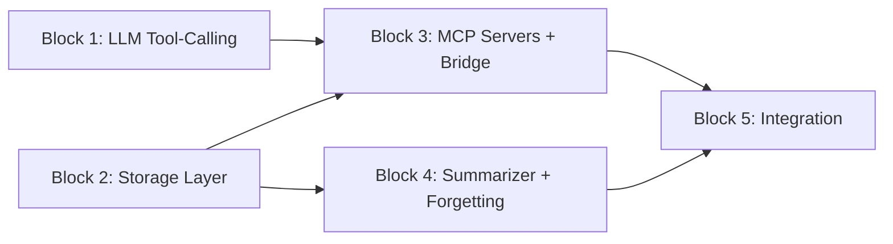

# Phase 5: Testable Implementation Blocks

The 10 implementation steps are grouped into 5 blocks. Each block can be implemented, tested, and verified independently before moving to the next. Block numbers are prefixed to every task title.

IMPORTANT: Executor of each block MUST implement automatical test and MUST perform manual testing, using acceptance creterias!

---

## Block 1: LLM Tool-Calling Extension

**Scope:** Step 1 only. Pure data-class and provider-interface changes in existing files.

**Tasks:**

- **[B1] Extend LLM provider with tool-calling support** -- Add `ToolDefinition`, `ToolCall`, `TOOL` role to `MessageRole`, extend `ChatMessage` with optional `tool_calls`/`tool_call_id`, extend `LLMResponse` with `tool_calls`, add `tools`/`tool_choice` params to `generate()`/`generate_stream()` signatures.
- **[B1] Implement tool-calling in OpenRouterProvider** -- Add tools to `_build_payload()`, parse `tool_calls` from response in `_parse_response()`, handle responses with tool_calls but no content.

**Files changed:** [src/mai_companion/llm/provider.py](src/mai_companion/llm/provider.py), [src/mai_companion/llm/openrouter.py](src/mai_companion/llm/openrouter.py)

### Manual Acceptance Criteria

1. Existing tests still pass (`pytest tests/test_llm/`). No regressions.
2. `ToolDefinition("search", "Search messages", {"type": "object", "properties": {...}})` can be instantiated without errors.
3. `ChatMessage` can be created with `tool_calls=[ToolCall(...)] `and with `tool_call_id="abc"`.
4. `MessageRole.TOOL` exists and equals `"tool"`.
5. Calling `generate()` without `tools` parameter works exactly as before (backward compatibility).
6. Calling `generate()` with a `tools` list includes the tools in the HTTP payload (verify via logs or mock).

### Automatic Testing

**File:** `tests/test_llm/test_provider.py` (extend existing) + `tests/test_llm/test_openrouter.py` (extend existing)

| Test | What it verifies |

|---|---|

| `test_tool_definition_creation` | `ToolDefinition` dataclass instantiates with name, description, parameters |

| `test_tool_call_creation` | `ToolCall` dataclass instantiates with id, name, arguments |

| `test_message_role_tool` | `MessageRole.TOOL == "tool"` and is a `str` subclass |

| `test_chat_message_with_tool_calls` | `ChatMessage` with `tool_calls` list works; without it defaults to `None` |

| `test_chat_message_with_tool_call_id` | `ChatMessage` with `tool_call_id` for tool-response messages |

| `test_llm_response_with_tool_calls` | `LLMResponse` with `tool_calls` list; empty by default |

| `test_generate_without_tools_unchanged` | Call `generate(messages)` without tools; verify payload has no `tools` key (mock `httpx`) |

| `test_generate_with_tools_payload` | Call `generate(messages, tools=[...]) `; verify payload includes `tools` array in OpenAI format (mock `httpx`) |

| `test_parse_response_with_tool_calls` | Feed a mock OpenAI response containing `tool_calls` into `_parse_response()`; verify `LLMResponse.tool_calls` is populated |

| `test_parse_response_no_content_with_tool_calls` | Response has `tool_calls` but `content` is `null`; verify `LLMResponse.content` is empty string, `tool_calls` populated |

| `test_backward_compat_existing_tests` | All existing `test_provider.py` and `test_openrouter.py` tests pass without modification |

**Mocking strategy:** Mock `httpx.AsyncClient.post` to return canned JSON responses. No real API calls.

---

## Block 2: Storage Layer (MessageStore + WikiStore + SummaryStore)

**Scope:** Steps 2 (MessageStore only), 3 (WikiStore only), 5 (SummaryStore). Pure data access -- no LLM, no MCP. These three stores are independent of each other and can even be developed in parallel.

**Tasks:**

- **[B2] MessageStore** -- `save_message()`, `get_short_term()` (recent 30 + all today, deduplicated), `search()` (LIKE-based), `get_messages_for_date()`, `get_messages_in_range()`. Uses SQLAlchemy async sessions and the existing `Message` model.
- **[B2] WikiStore** -- `create_entry()`, `edit_entry()`, `read_entry()`, `search_entries()`, `get_top_entries()`, `list_entries()`, `delete_entry()`, `decay_importance()`. File-based `.md` storage with importance-prefixed filenames. Also creates `KnowledgeEntry` DB records.
- **[B2] SummaryStore** -- `save_daily()`, `save_weekly()`, `save_monthly()`, `get_all_summaries()`, `delete_daily()`, `delete_weekly()`, `list_dailies()`. Pure file I/O with `data/{companion_id}/summaries/{type}/{period}.md`.

**New files:**

- `src/mai_companion/memory/messages.py`
- `src/mai_companion/memory/knowledge_base.py`
- `src/mai_companion/memory/summaries.py`

### Manual Acceptance Criteria

1. **MessageStore:** Insert 5 messages via `save_message()`, call `search("keyword")` -- returns matching messages. Call `get_short_term()` -- returns recent messages + all today's. Verify with a small pytest or script.
2. **MessageStore multilingual:** Insert a message containing "今日は天気がいい", search for "天気" -- returns the message. Insert "Привет мир", search for "мир" -- returns it. This confirms LIKE search works for CJK and Cyrillic.
3. **WikiStore:** Call `create_entry(companion_id, "human_name", "Alex", 9999)` -- verify file `data/{id}/wiki/9999_human_name.md` exists on disk with correct content. Call `edit_entry()` to change importance to 9500 -- verify file renamed to `9500_human_name.md`. Call `search_entries("Alex")` -- returns the entry.
4. **WikiStore key collision:** Call `create_entry()` twice with the same key -- second call should raise an error or return a clear message (not silently overwrite).
5. **SummaryStore:** Call `save_daily(id, date(2026, 2, 14), "Summary text")` -- verify `data/{id}/summaries/daily/2026-02-14.md` exists. Call `get_all_summaries()` -- returns it. Call `delete_daily()` -- file is gone.
6. **SummaryStore ordering:** Save 2 daily, 1 weekly, 1 monthly summaries. `get_all_summaries()` returns them in chronological order (monthly first, then weekly, then daily).

### Automatic Testing

**Files:** `tests/test_memory/test_messages.py`, `tests/test_memory/test_knowledge_base.py`, `tests/test_memory/test_summaries.py`

**MessageStore tests** (use in-memory SQLite from conftest `session` fixture):

| Test | What it verifies |

|---|---|

| `test_save_and_retrieve_message` | Save a message, fetch by `get_short_term()`, verify content/role/timestamp |

| `test_short_term_limit` | Save 40 messages, `get_short_term(limit=30)` returns exactly 30 most recent |

| `test_short_term_includes_all_today` | Save 35 messages today + 5 yesterday; verify all 35 today messages are included even if limit is 30 |

| `test_short_term_deduplication` | Verify no duplicates when today's messages overlap with the "recent 30" window |

| `test_search_basic` | Save messages with known content, search by keyword, verify correct results |

| `test_search_case_insensitive` | Search "paris" matches "I went to Paris" (SQLite LIKE is case-insensitive for ASCII) |

| `test_search_cjk` | Save message with "今日は天気がいい", search "天気" -- returns it |

| `test_search_cyrillic` | Save message with "Привет мир", search "мир" -- returns it |

| `test_search_limit` | Save 30 matching messages, search with limit=10, verify only 10 returned |

| `test_search_order_newest_first` | Verify results are ordered by id DESC |

| `test_get_messages_for_date` | Save messages on two different dates, fetch one date, verify only that date's messages returned |

| `test_get_messages_in_range` | Save messages across 5 days, fetch a 3-day range, verify correct subset |

**WikiStore tests** (use `tmp_path` fixture for filesystem + `session` fixture for DB):

| Test | What it verifies |

|---|---|

| `test_create_entry_file` | Creates file with correct name pattern `{importance:04d}_{key}.md` |

| `test_create_entry_content` | File content matches the provided content |

| `test_create_entry_db_record` | `KnowledgeEntry` row exists in DB with correct fields |

| `test_create_duplicate_key_error` | Creating same key twice raises appropriate error |

| `test_edit_entry_content` | Content is updated in the file |

| `test_edit_entry_importance_renames_file` | Changing importance renames the file |

| `test_read_entry` | Returns content string for existing key; `None` for non-existent |

| `test_search_entries_by_key` | Search matches against file names |

| `test_search_entries_by_content` | Search matches against file content |

| `test_get_top_entries` | Returns entries sorted by importance DESC, limited to N |

| `test_list_entries` | Returns all entries |

| `test_delete_entry` | File removed from disk, DB record deleted |

| `test_decay_importance` | Importance reduced by specified amount; file renamed accordingly |

| `test_key_sanitization` | Keys with spaces, special chars are sanitized to safe filenames |

**SummaryStore tests** (use `tmp_path` fixture):

| Test | What it verifies |

|---|---|

| `test_save_daily` | File created at correct path with correct content |

| `test_save_weekly` | File created at `summaries/weekly/2026-W07.md` |

| `test_save_monthly` | File created at `summaries/monthly/2026-01.md` |

| `test_get_all_summaries_ordering` | Monthly -> weekly -> daily, chronologically within each tier |

| `test_get_all_summaries_empty` | Returns empty list when no summaries exist |

| `test_delete_daily` | File removed; `get_all_summaries()` no longer includes it |

| `test_delete_weekly` | Same for weekly |

| `test_list_dailies` | Returns list of dates that have daily summaries |

| `test_auto_creates_directories` | Directories are created on first use if they don't exist |

**Mocking strategy:** No mocks needed. Use real in-memory SQLite (conftest `session`) and `tmp_path` for filesystem.

---

## Block 3: MCP Servers + Manager + Bridge

**Scope:** Steps 2 (MCP server part), 3 (MCP server part), 4. Builds on Block 1 (tool-calling) and Block 2 (stores). This block wires the stores into real MCP servers, creates the MCPManager, the OpenAI bridge, and the agentic tool-calling loop.

**Tasks:**

- **[B3] Messages MCP Server** -- Real MCP server (using `mcp` SDK) exposing `search_messages` tool, backed by MessageStore.
- **[B3] Wiki MCP Server** -- Real MCP server exposing `wiki_create`, `wiki_edit`, `wiki_read`, `wiki_search` tools, backed by WikiStore.
- **[B3] MCP Manager** -- `register_server()`, `list_all_tools()`, `call_tool()`. Aggregates tools from all registered servers.
- **[B3] MCP-to-OpenAI Bridge** -- `mcp_tools_to_openai()`, `openai_tool_call_to_mcp()`, `mcp_result_to_openai()`, `run_with_tools()` (agentic loop).
- **[B3] Add `mcp>=1.0` to pyproject.toml dependencies.**

**New files:**

- `src/mai_companion/mcp_servers/__init__.py`
- `src/mai_companion/mcp_servers/messages_server.py`
- `src/mai_companion/mcp_servers/wiki_server.py`
- `src/mai_companion/mcp_servers/manager.py`
- `src/mai_companion/mcp_servers/bridge.py`

### Manual Acceptance Criteria

1. **MCP tool listing:** Instantiate MCPManager, register both built-in servers. Call `list_all_tools()` -- returns 5 tools (1 from messages + 4 from wiki) with correct names and input schemas.
2. **Message search via MCP:** Call `call_tool("messages", "search_messages", {"query": "Paris"})` -- returns formatted message results (with timestamps and roles).
3. **Wiki create via MCP:** Call `call_tool("wiki", "wiki_create", {"key": "human_name", "content": "Alex", "importance": 9999})` -- verify file created on disk.
4. **OpenAI format conversion:** Call `mcp_tools_to_openai(tools)` -- each tool has `{"type": "function", "function": {"name": ..., "description": ..., "parameters": ...}}` format.
5. **Agentic loop (mock LLM):** Set up a mock LLM that returns a `tool_call` on first call and a text response on second call. Run `run_with_tools()` -- verify it executes the tool, feeds the result back, and returns the final text.
6. **Agentic loop max iterations:** Set up a mock LLM that always returns tool_calls. Run `run_with_tools(max_iterations=3)` -- verify it stops after 3 iterations and returns a partial response or error.

### Automatic Testing

**Files:** `tests/test_mcp/test_messages_server.py`, `tests/test_mcp/test_wiki_server.py`, `tests/test_mcp/test_manager.py`, `tests/test_mcp/test_bridge.py`

**Messages MCP Server tests:**

| Test | What it verifies |

|---|---|

| `test_list_tools` | Server exposes exactly 1 tool named `search_messages` |

| `test_search_messages_tool_schema` | Tool has `query` (required string) and `limit` (optional int) parameters |

| `test_call_search_messages` | Returns formatted message strings with timestamps |

| `test_call_search_messages_empty` | Returns a "no messages found" message when nothing matches |

**Wiki MCP Server tests:**

| Test | What it verifies |

|---|---|

| `test_list_tools` | Server exposes exactly 4 tools: `wiki_create`, `wiki_edit`, `wiki_read`, `wiki_search` |

| `test_call_wiki_create` | Creates entry via WikiStore; returns success message |

| `test_call_wiki_edit` | Updates entry; returns success message |

| `test_call_wiki_read` | Returns content of existing entry |

| `test_call_wiki_read_not_found` | Returns "not found" for non-existent key |

| `test_call_wiki_search` | Returns matching entries |

**MCPManager tests:**

| Test | What it verifies |

|---|---|

| `test_register_and_list_tools` | Register 2 servers; `list_all_tools()` returns combined tools |

| `test_call_tool_routes_correctly` | `call_tool("messages", "search_messages", ...)` routes to messages server |

| `test_call_tool_unknown_server` | Raises error for unregistered server name |

| `test_call_tool_unknown_tool` | Raises error for non-existent tool on a registered server |

**MCPBridge tests:**

| Test | What it verifies |

|---|---|

| `test_mcp_tools_to_openai_format` | Converts MCP tools to OpenAI function-calling format correctly |

| `test_openai_tool_call_to_mcp_routing` | Parses OpenAI tool_call and identifies correct server + tool |

| `test_mcp_result_to_openai_string` | Formats MCP result as string for OpenAI tool response |

| `test_run_with_tools_no_tool_calls` | LLM returns text directly; loop exits after 1 iteration |

| `test_run_with_tools_single_tool_call` | LLM returns tool_call, then text; loop executes tool and returns final text |

| `test_run_with_tools_multiple_tool_calls` | LLM returns 2 tool_calls in one response; both executed |

| `test_run_with_tools_max_iterations` | LLM always returns tool_calls; loop stops at max_iterations |

| `test_run_with_tools_tool_error_handling` | Tool execution raises error; error message fed back to LLM gracefully |

**Mocking strategy:** Mock the LLM provider (return canned `LLMResponse` with `tool_calls`). Use real MessageStore/WikiStore with in-memory SQLite and `tmp_path`. MCP servers are instantiated in-process.

---

## Block 4: Automatic Memory Subsystem (Summarizer + Forgetting)

**Scope:** Steps 6 and 7. Background processes that use the LLM for summarization and manage the lifecycle of summaries. Depends on Block 2 (stores).

**Tasks:**

- **[B4] MemorySummarizer** -- `generate_daily_summary()`, `generate_weekly_summary()`, `generate_monthly_summary()`, threshold trigger. Uses a neutral summarizer prompt (not the companion's personality).
- **[B4] ForgettingEngine** -- `run_forgetting_cycle()` with weekly consolidation and monthly consolidation.

**New files:**

- `src/mai_companion/memory/summarizer.py`
- `src/mai_companion/memory/forgetting.py`

### Manual Acceptance Criteria

1. **Daily summary generation:** Seed the DB with 20 messages for 2026-02-14. Call `generate_daily_summary(companion_id, date(2026, 2, 14))`. Verify: (a) LLM was called with the neutral summarizer prompt + the 20 messages, (b) a file `data/{id}/summaries/daily/2026-02-14.md` was created with the summary text.
2. **Weekly summary generation:** Create 7 daily summary files. Call `generate_weekly_summary()`. Verify: a weekly `.md` file was created containing a condensed version.
3. **Monthly summary generation:** Create 4 weekly summary files. Call `generate_monthly_summary()`. Verify: a monthly `.md` file was created.
4. **Forgetting -- weekly consolidation:** Create daily summaries for 10 days ago through 4 days ago (7 dailies). Run `run_forgetting_cycle()`. Verify: dailies older than 7 days are deleted, a weekly summary was created for their ISO week.
5. **Forgetting -- monthly consolidation:** Create weekly summaries for 5+ weeks ago. Run `run_forgetting_cycle()`. Verify: weeklies older than 4 weeks are deleted, a monthly summary was created.
6. **Summarizer prompt is neutral:** Inspect the system prompt used by the summarizer -- it must NOT contain any companion personality traits.

### Automatic Testing

**Files:** `tests/test_memory/test_summarizer.py`, `tests/test_memory/test_forgetting.py`

**MemorySummarizer tests:**

| Test | What it verifies |

|---|---|

| `test_generate_daily_summary` | Calls LLM with neutral prompt + day's messages; saves result via SummaryStore |

| `test_generate_daily_summary_no_messages` | Returns early or creates empty summary when no messages for the date |

| `test_generate_weekly_summary` | Reads daily summaries for the week; calls LLM; saves weekly file |

| `test_generate_monthly_summary` | Reads weekly summaries for the month; calls LLM; saves monthly file |

| `test_summarizer_prompt_is_neutral` | Assert the system prompt does NOT contain companion name or personality references |

| `test_summarizer_preserves_language` | If messages are in Japanese, the prompt instructs "Write in the same language as the conversation" |

| `test_threshold_trigger` | After N messages (configurable), summarizer is triggered automatically |

**ForgettingEngine tests:**

| Test | What it verifies |

|---|---|

| `test_weekly_consolidation` | Dailies older than 7 days grouped by ISO week; weekly created; dailies deleted |

| `test_weekly_consolidation_skips_recent` | Dailies from last 7 days are NOT consolidated |

| `test_weekly_consolidation_skips_existing` | If weekly already exists for that week, dailies are not re-consolidated |

| `test_monthly_consolidation` | Weeklies older than 4 weeks grouped by month; monthly created; weeklies deleted |

| `test_monthly_consolidation_skips_recent` | Weeklies from last 4 weeks are NOT consolidated |

| `test_full_forgetting_cycle` | End-to-end: seed data, run cycle, verify both consolidation operations happened |

**Mocking strategy:** Mock the LLM provider (return canned summary text). Use real SummaryStore with `tmp_path`. Use `freezegun` or manual date injection to control "today" for age calculations.

---

## Block 5: Context Assembly + Full Integration

**Scope:** Steps 8, 9, 10. The PromptBuilder, MemoryManager orchestrator, and the refactoring of BotHandler and main.py to use all the new subsystems. This is the final block that connects everything.

**Tasks:**

- **[B5] PromptBuilder** -- `build_context()` assembling system prompt + wiki top 20 + all summaries + short-term messages. Token budget management with truncation of oldest monthly summaries first.
- **[B5] MemoryManager** -- Orchestrator delegating to MessageStore, SummaryStore, WikiStore, MemorySummarizer, ForgettingEngine.
- **[B5] Refactor BotHandler** -- Replace inline message fetching with `PromptBuilder.build_context()`, replace `llm.generate()` with `MCPBridge.run_with_tools()`.
- **[B5] Update main.py** -- Initialize all memory subsystems, MCP servers, manager, bridge at startup.
- **[B5] Add new config settings** -- `memory_data_dir`, `summary_threshold`, `wiki_context_limit`, `short_term_limit`, `tool_max_iterations`.

**New files:**

- `src/mai_companion/core/prompt_builder.py`
- `src/mai_companion/memory/manager.py`

**Modified files:**

- [src/mai_companion/bot/handler.py](src/mai_companion/bot/handler.py)
- [src/mai_companion/main.py](src/mai_companion/main.py)
- [src/mai_companion/config.py](src/mai_companion/config.py)
- [pyproject.toml](pyproject.toml) (if not already done in Block 3)

### Manual Acceptance Criteria

1. **PromptBuilder output structure:** Create a PromptBuilder with fixture data (3 wiki entries, 2 summaries, 10 messages). Call `build_context()`. Verify the output is a list of `ChatMessage` objects with: (a) system message containing personality + mood + wiki section + summaries section, (b) short-term messages in chronological order.
2. **PromptBuilder token truncation:** Create a PromptBuilder with a very low token budget (e.g., 500 tokens). Provide many summaries. Verify that oldest monthly summaries are truncated first and a warning is logged.
3. **PromptBuilder wiki section:** Verify the "Things you know" section contains the top 20 wiki entries formatted as bullet points with importance scores.
4. **MemoryManager delegation:** Call `save_message()` -- verify it delegates to MessageStore. Call `get_all_summaries()` -- verify it delegates to SummaryStore.
5. **End-to-end conversation with tools (the ultimate test):**

   - Start the bot with all Phase 5 subsystems initialized.
   - Send a message: "My name is Alex and my birthday is March 15."
   - Observe in logs: the companion makes `wiki_create` tool calls to save the name and birthday.
   - Verify files `9999_human_name.md` and `9500_human_birthday.md` (or similar) appear in the wiki directory.
   - Send a message: "What do you know about me?"
   - Observe: the companion uses `wiki_search` or responds from the wiki entries already in context.
   - Send a message: "Remember when we talked about Paris?"
   - Observe: the companion uses `search_messages` tool to look up past messages.

6. **Config settings:** Verify all new settings have sensible defaults and can be overridden via environment variables.
7. **Backward compatibility:** Existing `/start`, `/reset`, `/mood`, `/help` commands still work.

### Automatic Testing

**Files:** `tests/test_core/test_prompt_builder.py`, `tests/test_memory/test_manager.py`, `tests/test_bot/test_handler.py` (extend existing)

**PromptBuilder tests:**

| Test | What it verifies |

|---|---|

| `test_build_context_structure` | Returns list of ChatMessage; first is SYSTEM with personality + wiki + summaries |

| `test_build_context_wiki_section` | System prompt contains "Things you know" section with top N wiki entries |

| `test_build_context_summaries_section` | System prompt contains "Your memories" section with summaries in chronological order |

| `test_build_context_short_term_messages` | Messages after system prompt are in chronological order (oldest first) |

| `test_build_context_deduplication` | No duplicate messages between "all today" and "recent 30" |

| `test_token_budget_truncation` | With low budget, oldest monthly summaries are removed first |

| `test_token_budget_warning_logged` | When approaching limit, a warning is logged (use `caplog` fixture) |

| `test_empty_wiki_and_summaries` | Works correctly when no wiki entries or summaries exist |

**MemoryManager tests:**

| Test | What it verifies |

|---|---|

| `test_save_message_delegates` | Calls MessageStore.save_message with correct args |

| `test_get_short_term_delegates` | Calls MessageStore.get_short_term |

| `test_get_all_summaries_delegates` | Calls SummaryStore.get_all_summaries |

| `test_get_wiki_top_delegates` | Calls WikiStore.get_top_entries |

| `test_trigger_daily_summary` | Calls MemorySummarizer.generate_daily_summary |

| `test_run_forgetting_cycle` | Calls ForgettingEngine.run_forgetting_cycle |

**BotHandler integration tests (extend existing):**

| Test | What it verifies |

|---|---|

| `test_conversation_uses_prompt_builder` | `_handle_conversation` calls PromptBuilder instead of inline prompt building |

| `test_conversation_uses_mcp_bridge` | `_handle_conversation` calls `MCPBridge.run_with_tools()` instead of direct `llm.generate()` |

| `test_conversation_saves_messages_via_memory_manager` | Both human and AI messages saved through MemoryManager |

| `test_existing_commands_still_work` | `/start`, `/reset`, `/mood`, `/help` unchanged |

**Config tests (extend `tests/test_config.py`):**

| Test | What it verifies |

|---|---|

| `test_memory_settings_defaults` | All new settings have correct default values |

| `test_memory_settings_override` | Settings can be overridden via constructor/env vars |

**Mocking strategy:** Mock LLM provider, mock stores where testing delegation (MemoryManager), use real stores with in-memory SQLite + `tmp_path` for integration tests.

---

## Dependency Diagram

Blocks 1 and 2 can be developed in parallel. Block 3 requires both 1 and 2. Block 4 requires only Block 2. Block 5 requires Blocks 3 and 4.

---

## General Testing Notes for the Performer

1. **Test runner:** `pytest tests/ -v --tb=short`. Use `pytest tests/test_memory/ -v` to run only one block's tests.
2. **Async tests:** All tests use `pytest-asyncio` with `asyncio_mode = "auto"` (already configured in `pyproject.toml`). Just write `async def test_...` and it works.
3. **Database fixture:** Use the existing `session` fixture from `conftest.py` for any test needing SQLite. It provides an in-memory DB with all tables created and rolls back after each test.
4. **Filesystem fixture:** Use pytest's built-in `tmp_path` fixture for any test creating files (wiki, summaries). Pass `tmp_path` as the base data directory to stores.
5. **LLM mocking pattern:** Create a simple `MockLLMProvider(LLMProvider)` that returns preconfigured `LLMResponse` objects. For tool-calling tests, configure it to return responses with `tool_calls` on specific iterations.
6. **Date mocking:** For forgetting/summarizer tests that depend on "today", either inject the date as a parameter or use `freezegun` (add to dev dependencies if needed).
7. **Test file naming:** Follow existing convention: `tests/test_{module}/test_{file}.py` mirroring `src/mai_companion/{module}/{file}.py`.
8. **Coverage target:** Aim for at least 90% line coverage on all new modules. Run `pytest --cov=mai_companion.memory --cov=mai_companion.mcp_servers --cov-report=term-missing` to check.